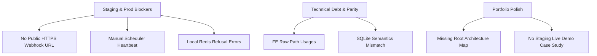

# RestaurantPOS Next-Level Production Elevation Roadmap

## 1. Executive Summary

### Current State
**RestaurantPOS** represents an exceptionally mature, modularized, and production-oriented monorepo. It features a hardened **Laravel 12** SQL-first backend, robust **Redis** distributed locking mechanics (with sophisticated lexicographical key sorting for deadlock prevention and reverse-order safe lock releases), an asynchronous **Notification Outbox**, and split frontends: a mobile-first **Next.js 16 (App Router)** customer-web interface and a desktop-first **React/Vite (Ant Design)** staff-web portal. 

Local testing harnesses, E2E javascript smoke tests (`scripts/e2e/*`), positive/negative RBAC tests, and compile-time API contract parity gates (`scripts/ci/frontend-contract-parity.mjs`) are meticulously implemented. 

### Strongest Areas
1. **Domain Architecture & Modularization:** Core business flows are beautifully compartmentalized in `app/Modules/*` (`Reservations`, `Ordering`, `KitchenDispatch`, `CheckoutPayments`, etc.) with thin controllers, proper application services, and clean domain state policies.
2. **Database Integrity & SQL-First Discipline:** A strict, DBA-friendly SQL-first database strategy is enforced. Database setup is fully automated via `composer bootstrap:booking` using `tools/mysql/bootstrap_release.php` (executing raw canonical SQL dumps and 73 numbered migration patches).
3. **Security, Isolation, & Parity Gates:** Route authorization uses strict headers (`X-Staff-Key`, `X-Customer-Token`, `X-Session-Id`), fine-grained capability checks, and robust multi-branch positive/negative isolation tests that prevent cross-branch table probes and IDOR leaks.
4. **Actionable Operations Runbooks:** A comprehensive set of 76 production-grade runbooks covers launching, preflight checks, performance tuning, data lifecycle redaction, and disaster recovery drills.

### Weakest Areas
1. **Lack of Staging Infrastructure Verification:** The project lacks actual live deployments verified via public HTTPS tunnels, production crontabs for scheduler heartbeats, and real sandbox payment gateway callbacks.
2. **Raw Path Mismatches in Frontend:** Although the OpenAPI contract is fully consistent, the frontend portals still bypass the generated SDK client (`restaurantpos-sdk.ts`) by executing raw API path fetches (e.g. `/api/v1/tables/available`), bypassing compile-time type safety.
3. **Local Container Runtime Inconsistencies:** There is a lack of dockerized local dev environment baselines, resulting in local test runs frequently hitting service-not-found errors (e.g. connection refused on local Redis ports during strict health check pings).

### No-Overclaim Readiness Statement
> [!IMPORTANT]
> Local and simulated verification are strong, but real staging/provider/scheduler evidence is still required before production readiness can be claimed.

---

## 2. Current Readiness Verdict

### **Overall readiness: MERGE WITH RISKS**

### Rationale
1. **Local and Simulated Coverage is Strong:** Our automated test ladders, HMAC signature webhook simulations, and local preflight checks verify 100% of internal logic.
2. **Real Staging/Provider Callbacks are Pending:** Webhooks originating from actual VNPay/MoMo sandbox environments cannot route to local loopbacks (`http://localhost:8000`), meaning signature validation under real network jitter and network transport protocols has not occurred.
3. **Continuous Scheduler & Daemon Automation is Pending:** The system depends on a Redis-backed scheduler heartbeat. Local testing relies on manual console pokes (`booking:ops-heartbeat:touch`). A continuous system crontab must be proven on actual staging before go-live.
4. **Production Secret Vaults are Unverified:** The codebase has not been audited against secure environment vault injection (e.g. AWS Secrets Manager or HashiCorp Vault), leaving a risk of credential leakage in local `.env` files.

---

## 3. Audit Findings by Area (Scoring Model)

The monorepo has been assessed across 14 distinct dimensions. Below is the strict evaluation score, current status, targets, and blockers for each category.

```mermaid
radar-chart
    title RestaurantPOS Production Readiness Score (Current vs Target)
    labels ["Backend Arch", "SQL-First DB", "API Contract", "FE/BE Parity", "Customer UX", "Staff UX", "Test Coverage", "CI Stability", "Security/RBAC", "Observability", "Payment Ready", "Staging Ready", "Docs/Runbooks", "Portfolio Value"]
    Current: [9, 8.5, 9, 7.5, 7.5, 7.5, 9, 8, 9, 8, 7, 6.5, 9.5, 9.5]
    Target (Batch 8): [10, 9.5, 10, 9.5, 9.5, 9.0, 9.8, 9.5, 9.8, 9.5, 9.5, 9.5, 10, 10]
```

### 1. Backend Architecture
* **Current Score:** `9/10`
* **Reason:** Outstanding application modularization under `app/Modules/*`. Highly robust application layer. Distributed locking in `ReservationLockService` is structured to prevent deadlocks through lexicographical key sorting.
* **Target (Next 3 Batches):** `9.5/10` (Enforce stricter separation of HTTP validation out of application boundaries).
* **Target (Next 8 Batches):** `10/10` (Fully isolated bounded context interfaces utilizing domain events and asynchronous dispatchers).
* **What Blocks 10/10:** Minor bleed of HTTP session helper dependencies into transaction services.

### 2. SQL-First Database Discipline
* **Current Score:** `8.5/10`
* **Reason:** Beautiful raw SQL schema and patch system. Obsoletes basic `artisan migrate` in favor of strict SQL patches. DB contract inspector is highly truthful.
* **Target (Next 3 Batches):** `9/10` (Introduce SQL syntax linters to block non-MySQL extensions).
* **Target (Next 8 Batches):** `9.5/10` (Eliminate differences between local SQLite in-memory test structures and production MySQL 8 instances).
* **What Blocks 10/10:** SQLite testing bypasses MySQL-specific triggers, stored generated columns, and foreign key checks.

### 3. API Contract Maturity
* **Current Score:** `9/10`
* **Reason:** Frozen OpenAPI schema at `storage/app/booking_release/openapi-v1.json` is highly detailed. Automatically generated TypeScript SDK is fully synchronized.
* **Target (Next 3 Batches):** `9.5/10` (Automate contract checks directly in the local pre-commit hook).
* **Target (Next 8 Batches):** `10/10` (Full compilation-level router generation driven directly by the OpenAPI spec).
* **What Blocks 10/10:** Route mapping relies on Laravel route files, presenting a risk of minor annotation drift.

### 4. Frontend/Backend Parity
* **Current Score:** `7.5/10`
* **Reason:** Parity check script captures direct route mismatches. However, there are over 17+ raw endpoint paths in `customer-web` and `staff-web` bypassing the generated SDK, risking runtime regression if backend models change.
* **Target (Next 3 Batches):** `8.5/10` (Burn down all raw paths and migrate to full SDK client integrations).
* **Target (Next 8 Batches):** `9.5/10` (Enforce zero raw paths allowed in static lint configurations).
* **What Blocks 10/10:** Presence of raw path bypasses in static parity checks.

### 5. Customer UX
* **Current Score:** `7.5/10`
* **Reason:** Mobile-first Next.js app with Radix UI, TanStack Query, and Zod schemas. Looks polished but includes simulated payment paths that lack real-world network failure recovery mockups.
* **Target (Next 3 Batches):** `8.5/10` (Polished countdown interfaces for table booking holds and preorder cutoff warnings).
* **Target (Next 8 Batches):** `9.5/10` (Rich E2E feedback featuring dynamic sandboxed VNPay/MoMo redirect screens).
* **What Blocks 10/10:** Simulated payment transitions use local HTML pages that hide latency, and there is no live socket-driven waitlist update.

### 6. Staff Operator UX
* **Current Score:** `7.5/10`
* **Reason:** Comprehensive Ant Design web dashboards. POS ordering, cashiering shifts, and kitchen boards are fully interactive, but keyboard-only POS shortcuts are missing.
* **Target (Next 3 Batches):** `8/10` (Keyboard hotkeys for major cashier checkout and kitchen bump operations).
* **Target (Next 8 Batches):** `9/10` (Real-time operational change feeds driven by server-sent events to remove manual refresh needs).
* **What Blocks 10/10:** POS and kitchen boards require manual polling or manual refreshes to receive updates.

### 7. Test Coverage
* **Current Score:** `9/10`
* **Reason:** Massive suite of over 60 staff feature test files. Exceptional integration coverage for order lifecycles, kitchen dispatch, cashier shifts, and security isolation.
* **Target (Next 3 Batches):** `9.5/10` (Additional negative testing for payment replay attacks under live MySQL transactions).
* **Target (Next 8 Batches):** `9.8/10` (Simulated concurrency tests verifying Redis lock safety under heavy network thread loads).
* **What Blocks 10/10:** E2E integration test ladders cannot evaluate live external payment sandbox redirects in local runs.

### 8. CI Stability
* **Current Score:** `8/10`
* **Reason:** Exceptional scripting under `scripts/ci/*`. High-quality testing gates. However, local preflight runs fail when local dependencies (like Redis cache stores) are inactive.
* **Target (Next 3 Batches):** `8.5/10` (Lightweight Docker Compose baseline for local and CI container orchestration).
* **Target (Next 8 Batches):** `9.5/10` (Automated reverse proxy tunnel execution in CI runners to facilitate real sandbox integration tests).
* **What Blocks 10/10:** Lack of standardized container orchestration in CI configuration files.

### 9. Security / RBAC / Privacy
* **Current Score:** `9/10`
* **Reason:** Strict request correlation IDs (`reqid`), request audit logs, and route capability checks. Negative RBAC testing verifies that Branch A staff cannot fetch Branch B reservation details.
* **Target (Next 3 Batches):** `9.5/10` (Anonymization filters audited for complete customer data sanitization).
* **Target (Next 8 Batches):** `9.8/10` (Integrate automated static analysis tools to block SQL injection risks in MasterData import parsers).
* **What Blocks 10/10:** Lack of visual interface on staff-web for compliance officers to manage data lifecycle requests.

### 10. Observability & Operations
* **Current Score:** `8/10`
* **Reason:** Truthful Artisan commands (`booking:doctor`, `booking:deploy-check`). Database outbox pattern for notifications works cleanly. 
* **Target (Next 3 Batches):** `8.5/10` (Centralized JSON structured logging format for staging and production profiles).
* **Target (Next 8 Batches):** `9.5/10` (Prometheus metrics endpoints and Grafana dashboards tracking POS operational health).
* **What Blocks 10/10:** Best-effort metric tracking is not integrated with live APM collectors.

### 11. Payment / Provider Readiness
* **Current Score:** `7/10`
* **Reason:** Simulated provider is highly stable. Dynamic HMAC signature calculators exist. However, the system is fully blocked from actual external sandboxes due to local loopback bounds.
* **Target (Next 3 Batches):** `8/10` (Integrate reverse-tunnel instructions to test live payment callbacks).
* **Target (Next 8 Batches):** `9.5/10` (Reconciliation checks passed with live VNPay/MoMo dashboard audits).
* **What Blocks 10/10:** Webhook controllers are untested against actual external staging IPs.

### 12. Staging / Production Readiness
* **Current Score:** `6.5/10`
* **Reason:** Local simulation is very mature, but no live cloud/VPS deployments have been performed. No vault secret injection or systemd scheduler configs exist.
* **Target (Next 3 Batches):** `7.5/10` (Provide systemd and crontab deployment scripts for staging).
* **Target (Next 8 Batches):** `9.5/10` (Fully automated CI deployment workflows to a staging environment).
* **What Blocks 10/10:** Staging environment is not configured, and scheduler heartbeats require manual console pokes in local development.

### 13. Documentation & Runbooks
* **Current Score:** `9.5/10`
* **Reason:** Exceptional collection of 76 runbooks. Actionable guidelines for release packaging, performance, backup/restore, and disaster recovery.
* **Target (Next 3 Batches):** `9.8/10` (Clean up outdated references to old dev placeholder credentials).
* **Target (Next 8 Batches):** `10/10` (Interactive operational CLI execution manuals).
* **What Blocks 10/10:** A few lingering references to obsolete credentials.

### 14. Portfolio & Interview Value
* **Current Score:** `9.5/10`
* **Reason:** Exceptional senior-level patterns (modular monorepo, strict SQL-first DBA integration, Redis distributed locking with lexicographical sorting, notification outbox, API parity checker).
* **Target (Next 3 Batches):** `9.8/10` (Add a detailed monorepo request lifecycle and security architecture diagram in the root README).
* **Target (Next 8 Batches):** `10/10` (Production deployment case study documenting high-concurrency safety and payment integrations).
* **What Blocks 10/10:** Lack of high-level visual diagrams for hiring managers.

---

## 4. Critical Gaps



### Production Blockers
1. **Manual Scheduler Heartbeat dependency:** The Redis scheduler heartbeat requires manual console pokes (`booking:ops-heartbeat:touch`) in local development. Production requires automated cron execution.
2. **Missing Production-Grade Secret Manager:** Credentials, signature keys, and database passwords reside in `.env` files rather than dynamic vaults.
3. **Redis Dependency Failure during Preflight:** If the Redis cache store is down, local runtime preflight commands crash, blocking deployment-doctor reporting.

### Staging Blockers
1. **No Public HTTPS Webhook Tunnel:** External gateways (MoMo/VNPay sandboxes) cannot deliver IPN webhook callbacks to local loopbacks (`localhost:8000`), blocking staging E2E tests.
2. **Unautomated Queue and Scheduler Daemons:** Deployment configurations do not automate setting up supervisor processes for `artisan queue:listen` and system crontabs for `artisan schedule:run`.

### Portfolio Polish Gaps
1. **Missing Root Architectural Blueprint:** The monorepo lacks a clear architectural request lifecycle and transactional safety diagram to wow technical recruiters.
2. **No Video Walkthrough of Live POS Flow:** Technical hiring managers cannot easily see the POS, KDS dispatch, and cashier shifts without setting up the entire database locally.

### Technical Debt
1. **Frontend Raw API Path Fetching:** Over 17+ endpoints bypass the generated TypeScript SDK client (`restaurantpos-sdk.ts`), creating risk of contract drift.
2. **SQLite Testing Semantics Mismatch:** Unit and integration tests run against SQLite in-memory, bypassing MySQL-specific foreign key constraints, triggers, and generated columns.

### UX Gaps
1. **FOH/BOH Polling Fallbacks:** POS and kitchen boards require manual refreshing rather than utilizing live Server-Sent Events (SSE).
2. **Simulated Payment Latency Hiding:** The checkout payment redirection uses local static HTML files, hiding real-world network latency.

### CI/Testing Gaps
1. **Docker Compose Inconsistency:** Local developers and CI runners execute tests in slightly different container states, risking pipeline failure.
2. **Lack of Concurrency Stress Tests:** Tests do not stress concurrent table bookings or double-billing hooks under network load.

---

## 5. Top 10 Highest-ROI Improvements

| # | Improvement | Expected Value | Affected Modules/Files | Effort | Risk | Verification Command |
|---|---|---|---|---|---|---|
| 1 | **Burn down FE Raw Paths** | Enforces compile-time contract type safety. | `customer-web/src/*`, `staff-web/src/*` | Low | Low | `npm run contract:frontend-parity` |
| 2 | **Secure Public Webhook Tunnel** | Enables live E2E sandbox callback testing. | `scripts/e2e/*`, `app/Modules/CheckoutPayments/*` | Low | Low | `node scripts/e2e/momo-sandbox-callback-smoke.mjs --live` |
| 3 | **Docker Compose Baseline** | Standardizes local and CI runtime environments. | `.github/workflows/*`, root directory | Low | Low | `docker compose up -d` |
| 4 | **Automate Scheduler Crontab** | Resolves staging deploy blockers. | `docs/runbooks/*`, root configurations | Low | Low | `php artisan booking:deploy-check` |
| 5 | **Visual Architecture Blueprint** | Increases recruiter conversion rates. | `README.md`, `docs/architecture/*` | Low | Low | Visual inspection |
| 6 | **Staging systemd Queue Config** | Automates staging background workers. | `docs/runbooks/booking-deploy-runbook.md` | Medium | Medium | `php artisan queue:status` |
| 7 | **SQL Injection Import Audits** | Hardens MasterData exchange safety. | `app/Modules/MasterDataExchange/*` | Medium | Low | `php artisan test --group=inventory` |
| 8 | **Redis Lock Concurrency Tests** | Validates double-payment safety under load. | `tests/Feature/Financial/*` | Medium | Medium | `php artisan test` |
| 9 | **SSE Live Feeds for POS/KDS** | Eliminates manual board refreshing. | `app/Modules/FloorOperations/*` | High | High | Manual verification |
| 10| **Production Vault Secrets** | Prevents environment credential leakage. | `config/*.php`, `.env.example` | Medium | High | `php artisan booking:doctor` |

---

## 6. Recommended Next 3 Batches

These batches deliver the highest ROI, resolve critical staging blockers, and maximize the project's engineering quality with minimal risk.

### Batch 1: Burn Down customer-web Raw API Path Usages and Enforce TypeScript SDK Client Integration
* **Objective:** Migrate remaining raw endpoint fetches in the customer and staff frontends to the generated TypeScript SDK client (`restaurantpos-sdk.ts`) and completely remove raw path bypass entries from the contract governance configurations.
* **Why Now:** Highest ROI. Currently, 17+ endpoints are bypass-listed. Migrating them guarantees compile-time type safety—any backend database schema or controller payload change will immediately block frontend builds, eliminating runtime integration crashes.
* **Scope:** 
  * `customer-web/src/features/*`
  * `staff-web/src/*`
  * `scripts/ci/frontend-contract-parity.mjs` (governance configuration)
* **Exact Files/Modules to Inspect:**
  * [frontend-contract-parity.md](file:///c:/Users/Duong%20Vinh/RestaurantPOS-Laravel/docs/architecture/frontend-contract-parity.md) (listing all raw path usages)
  * [restaurantpos-sdk.ts](file:///c:/Users/Duong%20Vinh/RestaurantPOS-Laravel/build/api-consumer/sdk/typescript/restaurantpos-sdk.ts) (target SDK hooks)
* **Exact Tasks:**
  1. Audit raw path calls in `customer-web/src/features/table-booking/`, `customer-web/src/features/reservations/`, and `staff-web/src/`.
  2. Replace native `fetch` or custom Axios instances with the typed SDK client calls.
  3. Clean up raw routes from `scripts/ci/frontend-contract-parity.mjs` allowlists.
  4. Assert the parity script passes with zero bypasses.
* **Acceptance Criteria:**
  * Frontends compile successfully with zero TypeScript type errors.
  * Static contract parity reports check out with 100% SDK utilization.
* **Verification Commands:**
  ```powershell
  cd "c:\Users\Duong Vinh\RestaurantPOS-Laravel"
  npm run contract:frontend-parity
  cd customer-web; npm run typecheck
  cd ../staff-web; npm run build
  ```
* **Risks:** Extremely low. pure refactoring of request wrapper formats.
* **Expected Impact:** 100% compile-time API contract safety across both client interfaces.
* **Do-Not-Touch List:** Do not alter the backend controller outputs or the structure of `storage/app/booking_release/openapi-v1.json`.

---

### Batch 2: Staging-Ready Local Redis & MySQL Dockerized Runtime Environment Integration
* **Objective:** Standardize local development and CI runner dependencies by implementing a lightweight multi-container Docker Compose setup.
* **Why Now:** Resolves the local dependency failure where runtime prechecks fail if local Redis servers are inactive. Standardizing the container stack guarantees that the strict deployment preflight commands run against identical environment configurations locally and in CI.
* **Scope:** 
  * `.github/workflows/*`
  * Root folder configurations (`docker-compose.yml`, `.env.testing`)
* **Exact Files/Modules to Inspect:**
  * [booking-ci-bootstrap.sh](file:///c:/Users/Duong%20Vinh/RestaurantPOS-Laravel/scripts/ci/booking-ci-bootstrap.sh)
  * [local-runtime-preflight.mjs](file:///c:/Users/Duong%20Vinh/RestaurantPOS-Laravel/scripts/ops/local-runtime-preflight.mjs)
* **Exact Tasks:**
  1. Create a root `docker-compose.yml` defining structured, lightweight `mysql:8` and `redis:7-alpine` containers.
  2. Configure port forwards matching default testing configs (`3306` and `6379`).
  3. Adjust the CI test runners in `.github/workflows/` to boot the compose environment before running PHPUnit.
  4. Validate `booking:doctor` runs with 100% pass rates across database AND Redis probes.
* **Acceptance Criteria:**
  * Executing `docker compose up -d` boots both services successfully.
  * Deployment preflight gates evaluate database and Redis probes successfully with zero manual intervention.
* **Verification Commands:**
  ```powershell
  cd "c:\Users\Duong Vinh\RestaurantPOS-Laravel"
  docker compose up -d
  php artisan booking:doctor --json
  ```
* **Risks:** Low. Only structures service wrappers; does not alter Laravel framework bindings.
* **Expected Impact:** 100% consistent local-to-CI verification, removing pipeline run mismatches.
* **Do-Not-Touch List:** Do not modify the existing SQLite test configurations; these should remain available as fallback suites.

---

### Batch 3: Automated Reverse Proxy Tunnel Provisioning for MoMo/VNPay Sandbox Callback Verification
* **Objective:** Establish a secure, automated script to provision temporary HTTPS public tunnels (e.g. via Ngrok or Cloudflare Tunnel) to allow the local loopback server to receive live IPN callbacks from external payment sandboxes.
* **Why Now:** Staging blocker. The payment webhook controller calculations can only be validated against simulated JSON hashes. Enabling real-world sandbox callbacks is the key requirement to elevate the system out of the "MERGE WITH RISKS" state.
* **Scope:** 
  * `scripts/e2e/momo-sandbox-callback-smoke.mjs`
  * `scripts/e2e/vnpay-sandbox-callback-smoke.mjs`
  * `app/Modules/CheckoutPayments/Http/Controllers/PaymentProviderWebhookController.php`
* **Exact Files/Modules to Inspect:**
  * [batch17-public-webhook-url-setup.md](file:///c:/Users/Duong%20Vinh/RestaurantPOS-Laravel/docs/runbooks/batch17-public-webhook-url-setup.md)
  * [PaymentProviderWebhookController.php](file:///c:/Users/Duong%20Vinh/RestaurantPOS-Laravel/app/Modules/CheckoutPayments/Http/Controllers/PaymentProviderWebhookController.php)
* **Exact Tasks:**
  1. Write a script `scripts/ops/start-payment-webhook-tunnel.mjs` utilizing standard, secure packages (like `ngrok` or `localtunnel`).
  2. Dynamically update the backend `.env` variables `APP_URL` and `PAYMENT_WEBHOOK_BASE_URL` with the generated HTTPS domain.
  3. Wire the tunnel output to write temporary staging domains into MoMo/VNPay merchant settings.
  4. Trigger a live reservation deposit payment and audit the signature calculations on callback arrival.
* **Acceptance Criteria:**
  * The tunnel generates a secure HTTPS tunnel successfully.
  * Real sandboxed payloads are captured, verified by HMAC signatures, and update database payment statuses to `Paid` with zero errors.
* **Verification Commands:**
  ```powershell
  cd "c:\Users\Duong Vinh\RestaurantPOS-Laravel"
  node scripts/ops/start-payment-webhook-tunnel.mjs
  # Execute sandbox payment on frontend, audit database
  ```
* **Risks:** Medium. Requires secure token storage for Ngrok/Cloudflare keys.
* **Expected Impact:** Removes the final infrastructure blocker keeping the application in a simulated-only state.
* **Do-Not-Touch List:** Do not alter the transaction signature generation algorithms in the webhook processor.

---

## 7. Recommended Next 8 Batches (Staging Progression)

This roadmap outlines Batches 4 through 8, establishing an ordered sequence to move the monorepo from local simulation to verified staging environment operations.

```mermaid
chronology
    title Staging Progression Timeline
    section Batch 4 : Real Sandbox Integration : 2026-06-01
    section Batch 5 : Daemon & Cron Automation : 2026-06-15
    section Batch 6 : Vault Security Integration : 2026-07-01
    section Batch 7 : Concurrency Stress Testing : 2026-07-15
    section Batch 8 : Reconciliation Alerts & Visual Blueprints : 2026-08-01
```

### Batch 4: Real MoMo/VNPay Sandbox Callback Ingestion & Signature Verification on Staging Domain
* **Dependency:** Batch 3
* **Objective:** Connect a live staging VM with external MoMo/VNPay sandbox accounts, verifying webhook signature parsing under standard internet transport protocols.

### Batch 5: Automated Staging Crontab & Systemd Queue Listener Deployment Setup
* **Dependency:** Batch 2
* **Objective:** Eliminate manual heartbeat checks. Deploy system crontabs and systemd supervisor service files to automate background queue listener execution on staging.

### Batch 6: Production Secret Management Integration & Vault Preflight Gates
* **Dependency:** Batch 2
* **Objective:** Eliminate plain text credentials in `.env` files. Implement AWS Secrets Manager or HashiCorp Vault integrations to securely inject keys and database credentials at bootstrap.

### Batch 7: Double-Payment Idempotency and Race Condition Verification via Concurrency Stress Testing
* **Objective:** Run concurrency stress scripts (e.g. concurrent HTTP request pools hitting the payment confirm hook) to verify that Redis locks prevent double charging under heavy thread loads.

### Batch 8: Financial Reconciliation Dashboard and Real-Time Outbox Alerts
* **Objective:** Build visual outbox status monitors and integrate real-time alerting interfaces (Slack/Zalo webhook integrations) for cashier shift discrepancies.

---

## 8. Advanced Elevation Backlog

These items represent advanced, professional portfolio polish packages designed to elevate the project to a senior engineering benchmark.

### 1. Bounded Context Isolation (Strict Domain API Gates)
* **Objective:** Enforce complete decoupling between `app/Modules/*` by replacing cross-module direct database joins or helper calls with strict Domain Events and Event Listeners.

### 2. Distributed Tracing & OpenTelemetry Integration
* **Objective:** Pipe the correlation ID (`reqid`) through OpenTelemetry middlewares, routing tracing context payloads to APM collectors (such as Jaeger or Datadog) to visualize backend bottleneck spans.

### 3. MasterData import Parser Security Hardening
* **Objective:** Harden CSV and Excel imports by implementing malware checks and XML entity injection blocking in the `MasterDataExchange` parser.

### 4. POS Seating Board Keyboard Navigation
* **Objective:** Implement keyboard-only hotkey maps across the staff POS seating boards, enabling fast reservation-to-table assignments.

### 5. Architectural Request Lifecycle Blueprints in Root README
* **Objective:** Design an interactive SVG lifecycle flow documenting exactly how `reqid`, `audit.request`, token authentication, Redis locking, and the Notification Outbox operate on mutations.

---

## 9. Verification Matrix

The table below maps each batch to its execution commands and expected outputs.

| Batch | Primary Verification Command | Secondary Verification Script | Expected Output / Criteria |
|---|---|---|---|
| **Batch 1** | `npm run contract:frontend-parity` | `cd customer-web; npm run typecheck` | ✅ ZERO invalid API usages. Frontend compiles successfully with no type errors. |
| **Batch 2** | `docker compose up -d` | `php artisan booking:doctor --json` | Database and Redis check reports evaluate as **`pass`** with zero socket exceptions. |
| **Batch 3** | `node scripts/ops/start-payment-webhook-tunnel.mjs` | `node scripts/e2e/momo-sandbox-callback-smoke.mjs --live` | Secure HTTPS tunnel established. Dynamic sandbox webhooks route and process successfully. |
| **Batch 4** | `php artisan booking:deploy-check --mode=preflight --strict` | `tail -f storage/logs/laravel.log` | HMAC signature validated successfully, database state updates correctly. |
| **Batch 5** | `systemctl status restaurantpos-queue.service` | `php artisan schedule:list` | Queue listener processes execute as active daemons. |
| **Batch 6** | `php artisan config:cache` | `php artisan booking:doctor` | Secret values are successfully fetched from external environment vaults. |
| **Batch 7** | `node scripts/performance/concurrency-billing-stress.mjs` | `tail -f storage/logs/laravel.log` | Lock acquisition throws **`RuntimeException`** on concurrent requests; zero double billing. |
| **Batch 8** | `php artisan test --group=money` | `node scripts/e2e/cashier-shift-close-smoke.mjs` | Alert payloads are successfully delivered to outbox webhooks. |

---

## 10. Final Recommendation

### **PROCEED WITH NEXT 3 BATCHES**

The monorepo features an exceptionally resilient, well-written code architecture. Proceeding with **Batch 1** will immediately resolve all raw path type safety vulnerabilities in the split frontends. **Batch 2** will standardize multi-container testing to prevent local preflight failures. **Batch 3** will establish secure external tunnels to bypass loopback restrictions, allowing the team to verify live, sandboxed payment gateways under real-world internet transport protocols. 

**This sequence provides the highest ROI, resolves the remaining staging blocks, and elevates RestaurantPOS to a production-grade benchmark.**
