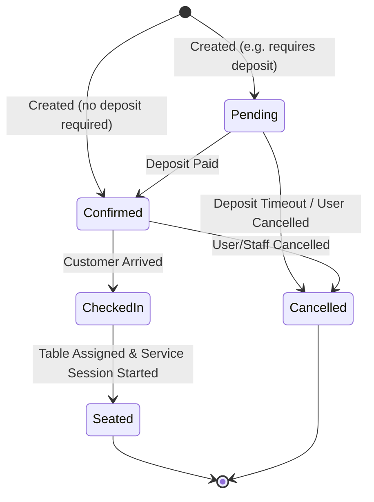
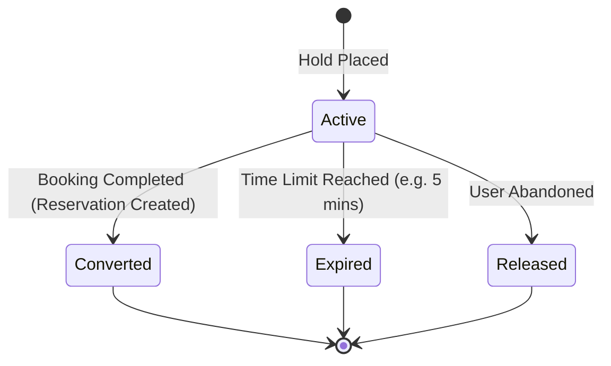
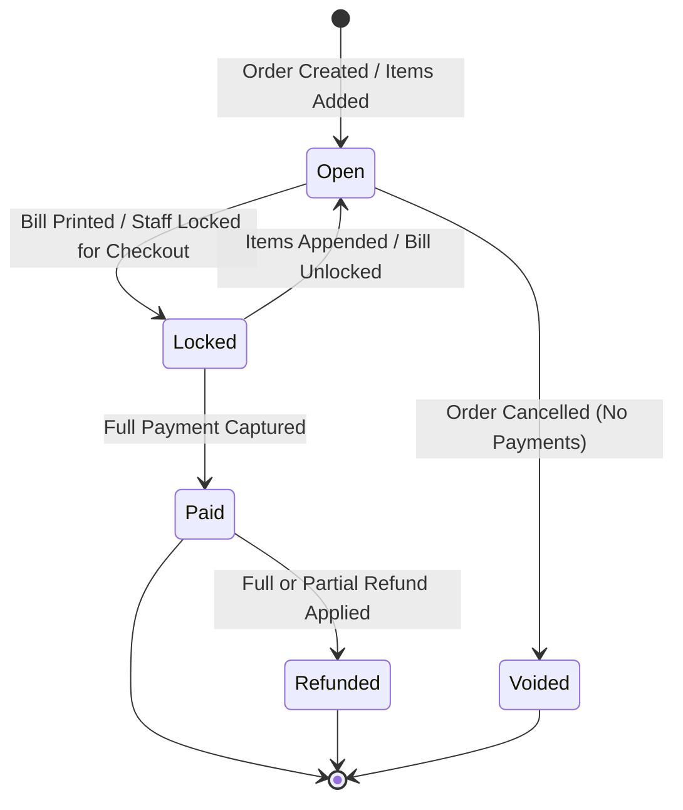
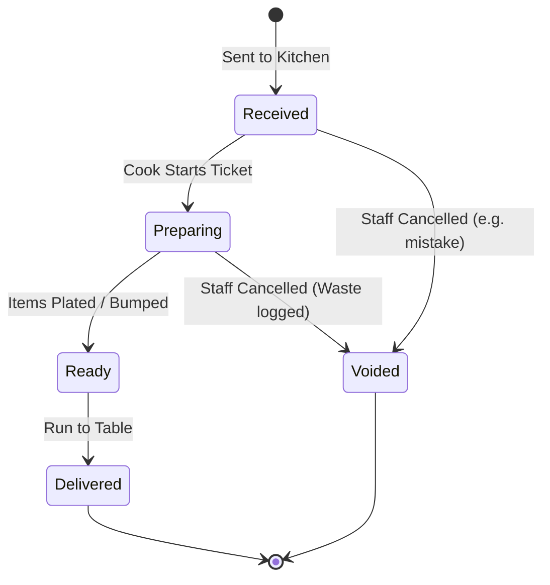
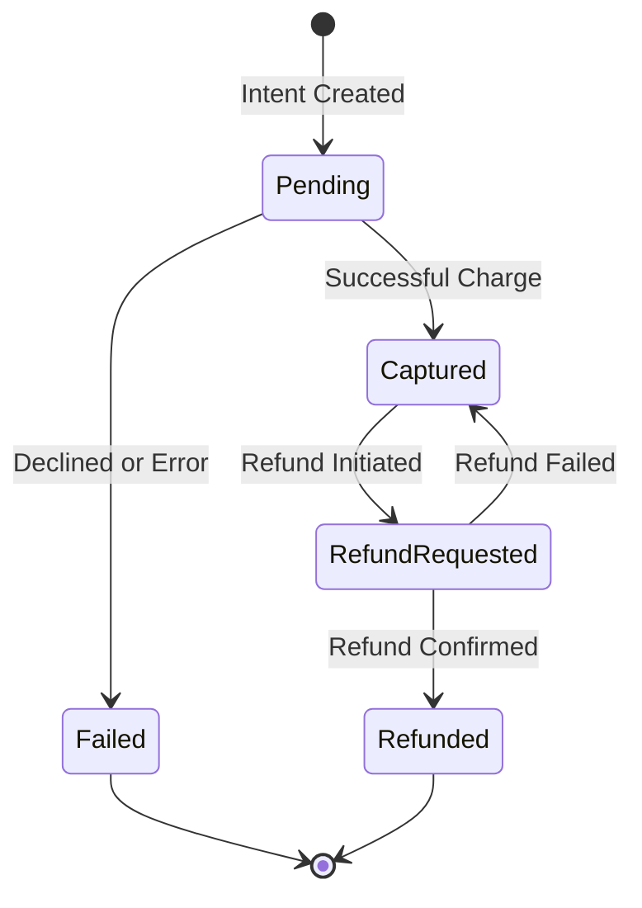
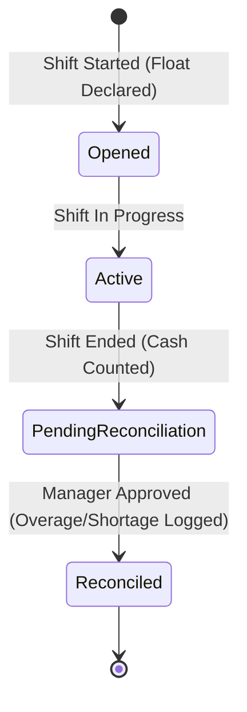

# State Machines

This document outlines the core state transitions for major entities in RestaurantPOS. These state machines govern the lifecycle of core business operations.

## Reservation Lifecycle

Reservations track a customer's intent to dine at a future time.

## Table Hold Lifecycle

Table holds temporarily block a table from being booked by someone else while a customer or staff member is actively completing a booking flow.

## Order Lifecycle

An order represents a physical bill/check for a table or walk-in.

## Kitchen Ticket Lifecycle

Kitchen tickets represent the instructions sent to a specific KDS (Kitchen Display System) station.

## Payment Lifecycle

Individual payment capture events.

## Cashier Shift Lifecycle

Tracks a cashier's till/drawer responsibility.

