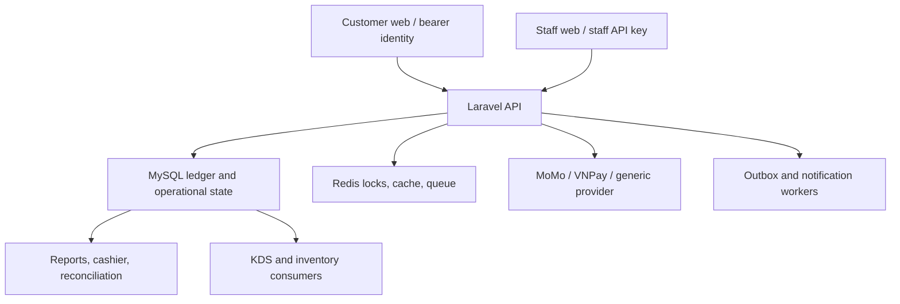

# RestaurantPOS — Exhaustive Adversarial Production Audit

**Audit date:** 2026-07-14  
**Target:** `main` at `3080e439e8c715e83fb27aa39ba753a92dffc36f`  
**Auditor posture:** production POS, real money, hostile retries, multi-branch least privilege  
**Verdict:** **NO-GO**

## 1. Executive verdict

This revision is **not safe for a real restaurant or real payment-provider traffic**. The audit confirmed six Critical defects: customer-side confirmation can create a captured payment without provider proof; provider-captured deposits can be silently omitted from the ledger; staff capture/refund can claim external money moved when only MySQL changed; staff can mutate resources in other branches; a confirmed preorder can be converted after checkout/bill lock; and the documented release bootstrap can destructively re-import a non-empty database without a production/disposable guard.

The result is not a documentation-gap verdict. It follows concrete call chains from route and request validation through service transactions, provider adapters, MySQL constraints, KDS snapshots, inventory consumption, frontend consumers, tests, and deployment scripts.

| Severity | Count | Release effect |
|---|---:|---|
| Critical | 6 | Any one is an automatic NO-GO under the supplied rubric |
| High | 15 | Payment/reporting failure, money precision, KDS/inventory drift, audit, deploy/DR and supply-chain exposure |
| Medium | 8 | Reconciliation governance, DB defense, queue recovery, contract-gate quality, ETA and identity semantics |
| Low | 1 | Corrupt example fixture/evidence quality |

**Product maturity:** strong engineering/demo and pre-staging foundation, but **not staging-ready for payment certification and not production-ready**. A controlled staging environment becomes reasonable only after all P0 items are fixed and the MySQL/Redis/provider test matrix passes.

## 2. Baseline, environment, and scope

### Reproducible baseline

| Item | Observed value |
|---|---|
| Branch | `main` |
| Commit | `3080e439e8c715e83fb27aa39ba753a92dffc36f` |
| Commit time | `2026-07-13T15:20:51+07:00` |
| Subject | `fix(pint): exclude ReservationLockService and BookingEnvironmentValidator from pint` |
| Remote | `https://github.com/DuongVinh2004/RestaurantPOS.git` |
| Initial worktree | clean |
| Application files sampled/count | 698 under `app/` |
| Test files | 361 under `tests/` |
| SQL patches | 68 `database/patches/*.sql` |

The checkout used for this audit was isolated from the user's working copy. No pull, merge, branch change, reset of user changes, source edit, commit, push, external message, real notification, provider call, or database mutation was performed. The only retained change is this report.

### Toolchain

| Tool | Version/status |
|---|---|
| OS/kernel | Linux x86_64, kernel `6.12.47` |
| Git | `2.51.1` |
| Bash | `5.2.21` |
| Node | `v24.14.0` |
| npm | `11.9.0` |
| PHP | unavailable |
| Composer | unavailable |
| MySQL client/server | unavailable |
| Redis CLI/server | unavailable |
| GitHub CLI | unavailable; repository metadata read through the connected GitHub integration |

### Scope covered

- Auth/RBAC, staff API keys, customer ownership, multi-branch isolation.
- Reservation, holds, waitlist, workbench assignment, preorder, order and service-session boundaries.
- KDS dispatch/tickets/transitions, component swap and downstream inventory consumption.
- Deposit, payment sessions, staff capture, refund lineage, cashier shift, currency precision.
- MySQL canonical schema and patches, Redis/queue/outbox failure semantics.
- Backend/frontends/OpenAPI contract tooling, dependency locks and current dependency advisories.
- CI/CD, production container path, backup/restore, release evidence and test quality.

### Explicitly unverified

The following are **UNVERIFIED**, not PASS:

- PHPUnit, Pint, PHPStan, Composer validation/audit, Artisan doctor/deploy/manifest/outbox commands: PHP and Composer are absent.
- MySQL 8 trigger/patch execution, deadlock behavior and query plans: no disposable MySQL service/client.
- Redis lock TTL/failover and queue-worker restart tests: no Redis/runtime.
- Browser/E2E/build: npm dependency installation failed because this execution environment returned corrupt registry tarballs.
- Real MoMo/VNPay/generic-provider capture, webhook ordering and refund: no sandbox credentials and no external money calls were permitted.
- Load, soak, accessibility and responsive visual testing.

## 3. Evidence ledger

| Command/check | Exit/result | Interpretation |
|---|---:|---|
| `git status --short` | 0, empty | Baseline clean |
| `git rev-parse HEAD`; `git branch --show-current`; `git remote -v` | 0 | Commit/branch/remote recorded above |
| `npm audit --omit=dev` (root) | 0 | 0 production vulnerabilities in root lock |
| `npm audit --omit=dev` (`staff-web`) | 1 | 2 moderate vulnerabilities via React Router |
| `npm audit --omit=dev` (`customer-web`) | 1 | 29 vulnerabilities: 6 high, 14 moderate, 9 low; direct `next@16.2.4` affected |
| `npm ci --ignore-scripts --no-audit --no-fund` (three workspaces) | 1 | Blocked by corrupt registry tarballs in audit environment; not attributed to source |
| `npm run verify:package` | 0 | 52 package-integrity checks passed |
| `staff-web: npm run integrity:check` | 0 | Staff integrity contract passed |
| `customer-web: npm run verify:contracts` | 0 | Customer contract governance check passed |
| `node scripts/ui-text-encoding-guard.mjs` | 0 | Tracked UI text guard passed |
| `npm run contract:frontend-parity` | 1 | Baseline false positives on valid template-literal dynamic paths; generated report was reverted |
| `npm run contract:frontend-parity:test` | 0 | Test only proves invalid allowlist rejection; does not cover the observed false positive |
| `npm run verify:package:test` | 0 | 3 tests passed |
| `npm run release:go-live-check:test` | 0 | 5 tests passed |
| `bash -n` over tracked shell scripts | 0 | No shell syntax failure found |
| `node --check` over tracked JS/MJS | 0 | No JS parse failure found |
| JSON parse scan over 184 tracked JSON files | 1 invalid file | `storage/app/uat/scenario-pack.example.json` has a BOM and mojibake |
| GitHub combined status at target SHA | 2 Vercel statuses succeeded | Insufficient evidence that GitHub Actions/release gates passed |

The package registry advisories are time-sensitive observations made on 2026-07-14. A future audit must rerun them against the same lockfiles.

## 4. Architecture and trust boundaries

Critical trust-boundary rules are: customer input cannot attest provider success; staff capability cannot substitute for branch entitlement; provider facts cannot be inferred from ledger requests; locked bill snapshots cannot coexist with later chargeable items; and every externally captured cent must appear in an auditable ledger state. This revision violates each of those rules.

## 5. Business invariant matrix

| Invariant | Result | Evidence summary |
|---|---|---|
| Only provider-verifiable success creates a non-cash captured payment | **FAIL** | C-01/C-03 |
| Every provider-captured amount is represented/reconciled | **FAIL** | C-02 |
| Refund status cannot be final before provider confirmation | **FAIL** | C-03 |
| Staff cannot read/mutate outside assigned branches | **FAIL** | C-04 |
| A locked/settled bill cannot gain new chargeable items | **FAIL** | C-05 |
| KDS item, order item and consumed recipe stay identical | **FAIL** | H-03 |
| Provider amount comparison uses one integer minor-unit type | **FAIL** | H-01 |
| Currency exponent is consistent PHP/MySQL/request/frontend | **FAIL** | H-02 |
| Production deploy runs release/SQL gates before code activation | **FAIL** | H-04 |
| Backups fail closed and restore is integrity-checked/atomic | **FAIL** | H-05 |
| Active dependency advisories block automatic production deploy | **FAIL** | H-06 |
| Reminder belongs to the current reservation schedule version | **FAIL** | H-07 |
| Revenue/refund reports reconcile across capture/refund dates | **FAIL** | H-09/H-10 |
| Business date follows branch timezone/cutoff | **FAIL** | H-11 |
| Inventory consumes the recipe committed with the order | **FAIL** | H-12 |
| Critical audit evidence cannot disappear or leak raw PII/session IDs | **FAIL** | H-13/H-14 |
| Fresh bootstrap cannot target a live/non-empty database by accident | **FAIL** | C-06 |
| Refund lineage/cap protected at service and DB boundaries | **PARTIAL** | Canonical service locks/caps; DB guard removed (M-02) |
| Two clients cannot claim one table concurrently | **UNVERIFIED** | Locking/overlap triggers look intentional; no MySQL race execution |
| Same idempotency key with changed payload is rejected | **PARTIAL** | Present in core money paths; full cross-module dynamic matrix not run |
| Duplicate KDS dispatch cannot create duplicate tickets | **UNVERIFIED** | Static guards exist; no MySQL/queue retry execution |
| Voucher/loyalty cannot double-spend under concurrency | **UNVERIFIED** | Runtime concurrency not available |
| Inventory opening + receive − consume ± adjust = closing | **UNVERIFIED** | Static paths reviewed; no executable MySQL reconciliation dataset |
| Customer cannot access another customer's payment session | **PASS (static scope)** | Session lookup remains reservation/customer scoped |
| Revoked/expired/deleted staff key is rejected | **PASS (static scope)** | Resolver checks were found; no bypass found |

## 6. Findings

### C-01 — Customer confirmation can create a captured payment without provider proof

- **Severity / confidence / status:** Critical / High / **CONFIRMED**.
- **Module/flow:** customer deposit and bill payment sessions.
- **Evidence:** confirm routes at `routes/api/customer_self_service.php:118-121,154-157`; mutation requests accept only `row_version`, `session_id`, and simulation data at `app/Modules/Payments/Http/Requests/Customer/MutateReservationDepositPaymentSessionRequest.php:17-23` and `MutateReservationBillPaymentSessionRequest.php:17-23`. Services call adapter confirm and immediately apply/capture at `CustomerReservationDepositPaymentService.php:220-227` and `CustomerReservationBillPaymentService.php:219-226`. VNPay defaults confirmation to `Succeeded` plus `vnp-mock-payment-code` at `VNPayPaymentProviderAdapter.php:249-268`; MoMo does the same at `MoMoPaymentProviderAdapter.php:215-234`. Generic HTTP HMAC falls back to local success when no confirm endpoint exists at `GenericHttpHmacPaymentProviderAdapter.php:93-101`; that endpoint defaults empty in `config/booking.php:351-356` and readiness does not require it at `PaymentProviderRolloutConfig.php:131-177`.
- **Violated invariant:** a customer/browser cannot attest that an external provider captured money.
- **Trigger/repro:** enable customer self-pay with VNPay/MoMo; create an owned session; POST its `/confirm` with the current row version. The adapter returns success and lifecycle creates a `Payment` although no provider was queried.
- **Expected / actual:** expected webhook or server-to-server verification of session, merchant, currency and amount; actual trusted local success with a fabricated provider payment code.
- **Impact/likelihood/blast radius:** direct unpaid checkout/deposit fraud for every enabled self-pay reservation. Configuration is disabled by default, but the runbook describes enabling live providers, so activation converts this into an immediately exploitable path.
- **Why tests miss it:** adapter tests accept mocked success and there is no negative integration test requiring provider-verifiable evidence for real providers.
- **Minimum fix:** remove client confirm for real providers; only a verified webhook or authenticated server-to-server status query may enter `Succeeded`; fail readiness when the confirmation/reconciliation capability is absent.
- **Post-fix verification:** signed-provider sandbox test: browser confirm without provider payment must fail and create zero payments; valid signed callback must create exactly one payment; replay must be idempotent.

### C-02 — A provider-captured deposit can be silently marked `Skipped` and omitted from the ledger

- **Severity / confidence / status:** Critical / High / **CONFIRMED**.
- **Module/flow:** concurrent/late customer deposit sessions.
- **Evidence:** session creation does not exclude another `Created/Pending` session and outstanding excludes sessions at `CustomerReservationDepositPaymentService.php:50-91,100-122,265-287`; schema uniqueness is reservation plus idempotency key, not one active session, at `database/schema/mysql-schema.sql:1277-1317`. A successful callback is changed to settlement `Skipped` with no `Payment` if the deposit is already satisfied or any final payment exists at `ReservationDepositPaymentSessionLifecycleWorkflow.php:124-155`.
- **Violated invariant:** every externally captured amount must have a ledger entry, even if it is overpayment/unapplied money.
- **Trigger/repro:** create two full-value sessions under different idempotency keys and pay both; the first callback creates a payment, the second becomes `Succeeded/Skipped`. Alternatively, let final settlement happen before a legitimate deposit callback arrives.
- **Expected / actual:** expected a unique active session or an unapplied/overpayment ledger row requiring reconciliation/refund; actual money exists at provider but not in `payments` or financial reports.
- **Impact/likelihood/blast radius:** lost reconciliation visibility, customer dispute risk and understated liabilities. Network retries and multi-tab checkout make the race realistic.
- **Why tests miss it:** no two-active-session test and no “late successful deposit after final capture” test; no assertion that every succeeded provider event links to a payment/unapplied-funds record.
- **Minimum fix:** enforce one active session by reservation/scope with a DB-safe strategy; never discard a verified success—record it as applied, overpaid or pending reconciliation.
- **Post-fix verification:** parallel create/pay test with two keys; assert both provider successes are represented and total provider capture equals ledger capture plus unapplied funds.

### C-03 — External capture/refund is ledger-only and can claim money moved when it did not

- **Severity / confidence / status:** Critical / High / **CONFIRMED**.
- **Module/flow:** staff final/deposit capture, refund, refund-and-cancel, cashier reconciliation.
- **Evidence:** refund requests accept caller-selected Cash/Card/MoMo/VNPay; `RefundExecutionService.php:149-213` copies method/provider, inserts `status=Refunded`, then may cancel the reservation at `:216-239`. `PaymentProviderAdapter.php:11-44` has no refund operation. `PaymentCaptureService.php:142-171` and `StaffReservationDepositService.php:203-232` similarly persist success/partial without provider proof. Cashier classification trusts the refund row's method/provider in `StaffCashierShiftService.php:506-544,633-639`.
- **Violated invariant:** non-cash capture/refund is a distributed financial operation, not a local status choice; refund lineage must inherit source provider/method.
- **Trigger/repro:** refund a Card source while submitting `Cash`, or request VNPay/MoMo refund. The database immediately reports refunded and may cancel the reservation although no provider refund was called. Expected drawer can also be reduced by a caller-chosen cash classification.
- **Expected / actual:** expected `RefundRequested/Pending` → idempotent provider call → verified `Refunded`, with compensating recovery; actual final ledger state is written synchronously from request input.
- **Impact/likelihood/blast radius:** customer not refunded, false financial statements, incorrect cash drawer, irreversible cancellation and disputes. Applies to all staff-mediated external payment/refund flows.
- **Why tests miss it:** tests exercise planner, cap and DB state but do not reconcile against a provider stub that can fail after/before DB writes.
- **Minimum fix:** derive provider/method from the source payment; model pending/failed/unknown states; implement idempotent provider refund/capture adapters and reconciliation jobs; separate manager-approved manual cash correction.
- **Post-fix verification:** provider stub matrix for timeout-before-response, provider success/DB failure, DB pending/provider failure, duplicate click and two-manager concurrent refund.

### C-04 — Systemic staff branch-isolation bypass permits cross-branch PII access and mutation

- **Severity / confidence / status:** Critical / High / **CONFIRMED**. Individual code review initially labeled these High, but the supplied rubric explicitly classifies cross-branch mutation as Critical.
- **Module/flow:** reservation timeline, waitlist, reservation creation, table holds, board assignments and preorders.
- **Evidence and attack surface:** 

  | Flow | Concrete evidence | Cross-branch effect |
  |---|---|---|
  | Timeline | `routes/api/staff_pos.php:253-254`; controller omits actor at `ReservationTimelineController.php:22-25`; raw unscoped query at `StaffReservationTimelineService.php:37-67,520-526` | Read all branches or choose branch B; exposes name/email/phone/notes/deposit via `StaffReservationInboxResource.php:77-110,130-144` |
  | Waitlist | routes `staff_pos.php:184-198`; no staff branch context in `StaffWaitingListService.php:56-79,111-170,202-385,586-611`; advance mutates by ID at `WaitingListOperationalOrchestrationService.php:120-208` | List/create/notify/seat/cancel/advance branch B; create reservations and change table state |
  | Reservation create | `customer_self_service.php:207-214`; controller checks only capability at `ReservationController.php:36-46`; create resolves table branch but does not call the branch helper at `ReservationService.php:183-238,320-353,816-824` | Staff A creates reservation using branch B table IDs |
  | Hold override | `TableHoldController.php:37-55,58-122,151-196`; ownership skipped with `allowStaffOverride` at `TableHoldService.php:417-466,469-531,534-656` | Read/cancel/extend known hold UUID in branch B without guest session |
  | Board assignment | routes `staff_pos.php:255-269`; unscoped loads/fast path/commit at `StaffReservationBoardAssignmentService.php:65-92,156-159,223-347,460-473` | Assign/best-fit branch B reservation/table and obtain customer snapshot |
  | Preorder | routes `staff_pos.php:270-281`; controller/service load by reservation ID without branch guard at `StaffReservationPreorderController.php:20-85`, `StaffReservationPreorderService.php:33-36,74-145,235-242` | Read, confirm, reject or convert branch B preorder |
  | Analytics overview | route `staff_pos.php:338-339`; handler receives but does not use actor and trusts optional branch ID at `GetAnalyticsOverviewHandler.php:17,32-40,55-61,86-95`; request only checks positive integer at `AnalyticsOverviewRequest.php:18-22` | Read all branches when omitted or select branch B explicitly |

- **Violated invariant:** capability answers *what* an actor may do; branch entitlement answers *where*. Both must hold inside the transaction after locking the target.
- **Trigger/repro:** assign staff only to branch A, give the documented capability, then submit valid branch-B IDs/UUIDs to the routes above. No branch assignment check is reached.
- **Expected / actual:** expected 404/deny and no information disclosure; actual cross-tenant reads and writes, including PII, table availability and reservation creation.
- **Impact/likelihood/blast radius:** any staff with common operational capabilities and a leaked/guessed ID can affect another location. Sequential IDs, boards and shared support channels make IDs obtainable.
- **Why tests miss it:** lifecycle/happy-path tests generally create one branch. There are no systematic actor × assigned branch × resource branch deny cases for these services.
- **Minimum fix:** make actor/accessible branch scope mandatory at service boundaries; apply `whereIn(branch_id, accessible)` to reads; repeat `assertAccessibleBranch` inside every locked mutation; return 404 for explicit inaccessible branch IDs.
- **Post-fix verification:** generated route matrix for every staff endpoint with A-only actor against A/B resources; assert B returns 404, emits no PII, makes no row/outbox/table-state change.

### C-05 — Preorder conversion after bill lock/checkout creates an unbilled active order

- **Severity / confidence / status:** Critical / High / **CONFIRMED**.
- **Module/flow:** reservation preorder → order → KDS → final bill/payment.
- **Evidence:** convert requires only preorder `Confirmed` and non-null `checked_in_at` at `StaffReservationPreorderService.php:146-156`; it then creates an `Active` order/items at `:160-218`. It does not require reservation `Reserved`, no checkout/bill/payment, or an unlocked bill. MySQL has no reservation/order state constraint and order triggers only manage row version at `database/schema/mysql-schema.sql:971-1018`. Settlement closes then-current active orders before marking reservation Completed at `SettlementFinalizerService.php:68-88`. Customer bill uses the locked `final_bill_amount` at `CustomerReservationOrderBillService.php:203-216`, and settlement can reuse the completed snapshot at `OrderSettlementWorkflow.php:767-783`. KDS dispatch checks only order Active at `DispatchKitchenOrderAction.php:55-74`.
- **Violated invariant:** a Completed/billed reservation cannot gain a new active, dispatchable, chargeable order.
- **Trigger/repro:** confirm preorder, complete/lock/pay the reservation, then call convert. An Active order is inserted on a Completed reservation; or convert during partial payment and the new lines are outside the locked final bill.
- **Expected / actual:** expected rejection once bill/session/payment/checkout starts; actual orphan order can reach KDS while normal mutation/serve later conflicts with terminal reservation guards.
- **Impact/likelihood/blast radius:** food can be prepared and inventory affected without being billed; staff cannot cleanly complete the lifecycle; financial snapshots understate revenue.
- **Why tests miss it:** no staff preorder feature tests for terminal/billed/partially paid reservations; schema permits the invalid combination.
- **Minimum fix:** under one transaction lock reservation, preorder, orders, payments and bill sessions; require serviceable `Reserved`, not checked out/billed, no final capture and no active payment session. KDS must also reject orders whose reservation is terminal.
- **Post-fix verification:** state × preorder × bill/payment truth table, including concurrent convert versus settlement; assert exactly one of them wins and no Active order exists on terminal reservation.

### C-06 — Release bootstrap can wipe a non-empty/live database without a destructive-operation guard

- **Severity / confidence / status:** Critical / High / **CONFIRMED** by executable control flow; destructive reproduction was intentionally not run.
- **Module/flow:** release database bootstrap and canonical SQL import.
- **Evidence:** `tools/mysql/bootstrap_release.php:18-23,45-64` creates the database when absent, then unconditionally imports canonical schema and every patch. It does not check `APP_ENV`, database emptiness, production identity or an explicit destructive confirmation. `database/schema/mysql-schema.sql:7,24` and subsequent sections use `DROP TABLE IF EXISTS`. The command is exposed through the documented Composer bootstrap workflow.
- **Violated invariant:** a “fresh/bootstrap” tool must prove the target is disposable before executing destructive DDL; forward-only production upgrade must be a separate path.
- **Trigger/repro:** configure the environment to an existing populated database, then run `composer bootstrap:booking`/`bootstrap:release-db`. The script reaches a schema import containing table drops without a safety interlock.
- **Expected / actual:** expected refusal unless target is empty/disposable plus a deliberate `--allow-destructive-bootstrap` acknowledgement and backup receipt; actual destructive import is the default behavior.
- **Impact/likelihood/blast radius:** total database loss and service outage. Likelihood depends on operator error or copied runbook commands, but blast radius is unrecoverable site-wide corruption if backup/restore also fails.
- **Why tests miss it:** no production-like/non-empty target refusal test; safe audit policy correctly prevented running the destructive path.
- **Minimum fix:** split fresh bootstrap from upgrade; hard-deny production and non-empty targets by default; require database identity allowlist, one-time confirmation, recent verified backup and a typed target name for destructive bootstrap.
- **Post-fix verification:** disposable MySQL tests for empty allowed, non-empty denied, `APP_ENV=production` denied, wrong host/name denied, and explicit development override audited.

### H-01 — Valid VNPay success is rewritten to `Failed/amount_mismatch`

- **Severity / confidence / status:** High / High / **CONFIRMED**.
- **Evidence:** `VNPayPaymentProviderAdapter.php:189-199` divides the provider integer by 100, yielding a PHP float; bill/deposit lifecycle compares it with integer `Money::minorUnits()` using strict `!==` at `ReservationBillPaymentSessionLifecycleWorkflow.php:42-50` and `ReservationDepositPaymentSessionLifecycleWorkflow.php:43-51`.
- **Invariant/repro:** a signed `vnp_Amount=5000000` should equal session amount `50000`; actual comparison is `50000.0 !== 50000`, so success becomes failure.
- **Impact/likelihood/blast radius:** all otherwise valid VNPay callbacks carrying amount can fail settlement. Customer is charged but POS shows unpaid.
- **Test gap:** `VNPayPaymentProviderAdapterTest.php:164-184` does not assert amount type or pass through lifecycle.
- **Fix/verify:** parse/validate into integer minor units and E2E a signed webhook through exactly-one payment creation.

### H-02 — Currency support and money precision are contradictory

- **Severity / confidence / status:** High / High / **CONFIRMED**.
- **Evidence:** `app/SharedKernel/Money/Money.php:11-42` uses `SCALE=0`/factor 1; tests lock `1.4→1`, `1.5→2` at `tests/Unit/Support/MoneyTest.php:18-23`. MySQL uses `decimal(14,2)` at `mysql-schema.sql:781`; `CheckoutOrderRequest.php:24-27` accepts arbitrary currency and decimals; USD/multi-currency behavior is exposed by `ReservationDepositReadService.php:50-70`; capture rounds before persistence at `PaymentCaptureService.php:121-123,147`.
- **Invariant/repro:** USD 10.49 must be 1049 cents; actual core representation becomes 10. USD 10.50 becomes 11.
- **Impact/likelihood/blast radius:** bill, refund, tax, loyalty and cashier discrepancies for any non-zero-exponent currency. If only VND is intended, accepting other currencies is still unsafe.
- **Test gap:** tests validate the unsafe rounding instead of a per-currency exponent contract.
- **Fix/verify:** use integer minor units with ISO currency exponent, or reject all non-VND currency at every boundary; property-test round trips across PHP/DB/JSON/TypeScript.

### H-03 — Swapping an in-progress combo component splits order, KDS and inventory truth

- **Severity / confidence / status:** High / High / **CONFIRMED**.
- **Evidence:** component swap route at `staff_pos.php:366-369`; `StaffOrderItemLifecycleService.php:81-127` allows `Ordered`/`InProgress`, loads any menu item and only updates order state. Ticket retains dispatched item/category/route/station snapshot at `mysql-schema.sql:2322-2353` and `DispatchKitchenOrderAction.php:191-201`. Consistency inspector omits item/category comparison at `KitchenTicketConsistencyInspector.php:65-87`. On serve, inventory consumes the *new* item's recipe at `OrderItemInventoryConsumptionService.php:31-64`.
- **Invariant/repro:** dispatch/fire old component at station X, then swap to a different recipe/category while InProgress. Kitchen makes old item, bill/order says new item, stock deducts new recipe.
- **Impact/likelihood/blast radius:** wrong dish, allergen/customer incident, stock drift and irreconcilable ticket. Normal UI action can trigger it.
- **Test gap:** `ComboOperationalFlowTest.php:174-233` swaps only before dispatch.
- **Fix/verify:** forbid swap after dispatch, or atomically cancel/acknowledge/recreate/re-route ticket using allowed/available substitutions; test ticket, bill and stock together.

### H-04 — Automatic production CD activates code before proving SQL/release safety

- **Severity / confidence / status:** High / High / **CONFIRMED**.
- **Evidence:** `.github/workflows/booking-cd.yml:3-7` runs on every `main` push; the only job has no CI/release `needs` or protected `environment`. Remote script resets to main and runs `docker-compose ... up -d --build` at `:31-36`, then runs deploy-check only at `:43-45`; no SQL apply, backup, immutable artifact, rollback or postflight. `Dockerfile.prod:32-50` and `docker-compose.prod.yml:4-36` start the app but do not apply patches. `BookingDeploySafetyService.php:296-313,595-613` checks the presence/shape of artifacts, not that the production patch ledger was applied. The comprehensive release workflow is manual-only at `.github/workflows/booking-release-gate.yml:3-25`.
- **Invariant/repro:** merge code that requires a new SQL patch. CD activates containers first; deploy-check can pass because files/schema artifacts exist while production DB remains stale.
- **Impact/likelihood/blast radius:** immediate production 500s/corruption on every branch, with no automated rollback. Every main push is exposed.
- **Test gap:** no deploy simulation asserts DB ledger before traffic activation or rollback after postflight failure.
- **Fix/verify:** build immutable artifact after required CI/release gates; backup; apply patches before compatible code activation using expand/contract; run postflight; retain one-command rollback; protect production environment.

### H-05 — Backup/restore fails open on offsite durability and restore integrity/atomicity

- **Severity / confidence / status:** High / High / **CONFIRMED**.
- **Evidence:** `scripts/ops/backup-to-s3.sh:69-74` silently changes to `LOCAL_ONLY` if AWS CLI is missing, then local copy and successful exit at `:169-175,208-209`. Restore treats missing remote checksum as warning at `scripts/ops/restore-from-s3.sh:159-164`; local checksum can also be absent at `:174-179`; verification is conditional at `:187-205`. It only gzip-tests at `:207-212` and imports directly into the target at `:225-235`.
- **Invariant/repro:** remove/misconfigure AWS CLI and run scheduled backup: job succeeds with no offsite copy. Restore a dump without checksum: it can import directly; a midstream failure leaves a partial target.
- **Impact/likelihood/blast radius:** false backup assurance and potentially unrecoverable/partially restored production DB. Site-wide impact.
- **Test gap:** no restore drill proving checksum-required, isolated staging import, application invariants and atomic cutover.
- **Fix/verify:** fail closed when offsite is required; require authenticated manifest/checksum; restore to isolated DB, validate schema/counts/ledger, then atomic switch; regularly test RPO/RTO. Production confirmation flags do exist and should be retained.

### H-06 — Vulnerable customer runtime and CI blind spot can reach automatic production CD

- **Severity / confidence / status:** High / High / **CONFIRMED** as dependency/gate state; exploitability varies by application feature.
- **Evidence:** current `npm audit --omit=dev` reports 29 customer production-tree vulnerabilities (6 high), including direct `next@16.2.4` declared at `customer-web/package.json:30` and locked at `customer-web/package-lock.json:9679-9680`. Advisories include App Router middleware/proxy bypass, DoS, XSS, cache poisoning and SSRF classes. Staff lock reports two moderate React Router issues, with `react-router-dom` declared at `staff-web/package.json:26`. Main CI only has staff-web install/build at `.github/workflows/booking-ci.yml:210-234` and explicitly uses `npm ci --no-audit`; customer install is in the manual release gate, whose bootstrap also uses `--no-audit` at `scripts/ci/booking-ci-bootstrap.sh:69-75`. Automatic CD does not depend on it.
- **Invariant/repro:** push main with the present locks; automatic CD is structurally allowed despite a failing production dependency audit and no customer-web main-CI job.
- **Impact/likelihood/blast radius:** Internet-facing customer app exposure and supply-chain regressions. Some advisories require specific middleware/cache/image/WebSocket patterns and must be threat-mapped, but a direct high-vulnerability framework plus absent gate is a release blocker.
- **Test gap:** no lockfile audit/SBOM/advisory policy gate tied to CD.
- **Fix/verify:** upgrade/replace affected direct dependencies, move CLI-only `shadcn` out of runtime dependencies where possible, add audited customer build/test on every PR/main, and require that gate before deploy.

### H-07 — Reminder deduplication is not tied to the current reservation schedule

- **Severity / confidence / status:** High / High / **CONFIRMED**.
- **Evidence:** reschedule email identity includes row version, but reminder identity is only `reservation:{id}:reminder:{lead}:email` at `NotificationOutboxService.php:229-249`; `enqueueMessage()` returns the existing row for that key at `:113-118`.
- **Invariant/repro:** after a reminder is sent, reschedule to a later date: the new reminder dedupes against the old sent row and never sends. If old reminder is Pending/Failed, it can later send stale time data.
- **Impact/likelihood/blast radius:** no-show/customer-service cost or misleading notifications for any rescheduled reservation. Rescheduling is routine.
- **Test gap:** no sent-before-reschedule or pending-at-reschedule supersession test.
- **Fix/verify:** include normalized start time/schedule version in identity; transactionally cancel superseded pending rows; worker rechecks current schedule version immediately before delivery.

### H-08 — Provider event ordering can make a transient failure permanently suppress later success

- **Severity / confidence / status:** High / Medium-High / **PROBABLE**; requires provider sandbox trace for final confirmation.
- **Evidence:** VNPay/MoMo assign receipt time rather than provider event time at `VNPayPaymentProviderAdapter.php:189-209` and `MoMoPaymentProviderAdapter.php:139-175`; stale logic uses `occurred_at` at `PaymentWebhookIngestionWorkflow.php:635-660`; `Failed/Cancelled/Expired` are terminal in `PaymentSessionStatusTransitionPolicy.php:23-25,39-49`.
- **Invariant/repro:** deliver a failure callback first and a legitimate success second for the same provider session. Because events are ordered by receipt and failure is terminal, the later success can be ignored.
- **Impact/likelihood/blast radius:** provider captured money while POS remains failed/unpaid. Network reordering/retries are normal; provider-specific emission rules remain unverified.
- **Test gap:** no provider-faithful out-of-order matrix with durable provider event IDs/timestamps.
- **Fix/verify:** persist provider event time/sequence and reconcile terminal conflicts by server-to-server status; sandbox test failure→success, success→failure, duplicate and delayed callback.

### H-09 — Analytics `total_revenue` ignores refunds

- **Severity / confidence / status:** High / High / **CONFIRMED**.
- **Module/evidence:** `GetAnalyticsOverviewHandler.php:53-68,80-84` sums only payments with `status=Success`. Refunds are positive-amount rows with `payment_type=Refund`, `status=Refunded` at `RefundExecutionService.php:165-182`, so they never reduce the displayed total.
- **Invariant/repro:** capture 100 and fully refund 100 in the selected period. Expected net revenue is 0 with gross/refund disclosed separately; actual `total_revenue` remains 100.
- **Impact/likelihood/blast radius:** systematic revenue overstatement in a primary management metric for every refund; all branches are further exposed through C-04.
- **Test gap:** controller test uses Admin and checks response shape only at `AnalyticsOverviewControllerTest.php:20-40`; no full/partial/same-day/cross-day refund fixture.
- **Fix/verify:** compute signed, lineage-aware capture/refund measures and label gross, refunds and net explicitly; reconcile against a golden payment ledger dataset.

### H-10 — Daily sales overstates lifetime net when refund occurs on another day

- **Severity / confidence / status:** High / High / **CONFIRMED**.
- **Evidence:** `ReportingSnapshotWorkflow.php:651-679` buckets payments by their own business-date candidate, then calls `PaymentSummary` separately per day at `:681-693`. `PaymentSummary.php:86-95` clamps net to at least zero and schema repeats non-negative net constraints at `mysql-schema.sql:42-53`.
- **Invariant/repro:** capture 100 on Monday and refund 100 Tuesday. Expected signed daily movement is Monday +100, Tuesday −100, lifetime 0; actual snapshots are Monday 100, Tuesday 0, total 100.
- **Impact/likelihood/blast radius:** branch/day/month revenue and accounting export remain overstated whenever refunds cross a date boundary, a common real workflow.
- **Test gap:** current fixtures cover capture/refund within one date, not a refund-only day or cross-period aggregation.
- **Fix/verify:** store gross captured and refunds separately and derive signed net without clamping; golden tests across day/month/year boundaries.

### H-11 — “Business date” snapshots are UTC dates, not branch-local business dates

- **Severity / confidence / status:** High / High / **CONFIRMED**.
- **Evidence:** branches store timezone at `mysql-schema.sql:501-508`, but `ReportingSnapshotWorkflow.php:597-598,610,641,664-674,704,723-724,765-803,856-875` constructs UTC ranges and repeatedly uses `utc()->toDateString()` without loading branch timezone/cutoff.
- **Invariant/repro:** record a transaction at 00:30 in `Asia/Ho_Chi_Minh`; it belongs to the new local day but is bucketed into the previous UTC date.
- **Impact/likelihood/blast radius:** daily sales, operations, inventory and close reports shift transactions at every local-midnight boundary; month/year totals can land in the wrong accounting period.
- **Test gap:** no per-branch local midnight, DST-capable timezone, month/year end or close-after-midnight matrix.
- **Fix/verify:** central branch business-date resolver (timezone plus configured cutoff), convert local ranges to UTC for queries, and preserve business-date identity in snapshots.

### H-12 — Inventory consumption uses the recipe at serve time, not the recipe sold

- **Severity / confidence / status:** High / High / **CONFIRMED**.
- **Evidence:** on transition to Served, `OrderItemInventoryConsumptionService.php:60-83` reads current `menu_item_recipes`; `reservation_order_items` snapshots name/price but no recipe/version at `mysql-schema.sql:909-929`.
- **Invariant/repro:** order an item whose recipe is 100 g, edit recipe to 150 g before serving, then serve. Expected ledger consumes the committed order recipe (100 g); actual consumes 150 g.
- **Impact/likelihood/blast radius:** stock valuation and ingredient availability drift after routine recipe maintenance; every open order for the edited item is affected.
- **Test gap:** no recipe-edit-after-order scenario or immutable recipe-version assertion.
- **Fix/verify:** version/snapshot recipe components at order commit and consume that version; test edits before/after order/dispatch/serve and retry-safe stock references.

### H-13 — Critical audit recording fails open

- **Severity / confidence / status:** High / High / **CONFIRMED**.
- **Evidence:** structured insert occurs at `AuditTrailRecorder.php:52-69`, but all errors are swallowed at `:70-75`; `AuditEvent.php:27-59` also catches every failure.
- **Invariant/repro:** make the audit table/channel unavailable during a financial, RBAC or inventory mutation. Expected critical mutation to share the transaction or enqueue durable evidence; actual business mutation can commit without a structured audit row.
- **Impact/likelihood/blast radius:** fraud/incident reconstruction and accountability disappear exactly during schema/storage outages. All critical modules using this recorder are affected.
- **Test gap:** no failure-injection test requiring rollback/durable audit outbox for critical event classes.
- **Fix/verify:** record critical audit in the same transaction or a guaranteed transactional outbox; define which low-risk telemetry may fail open; alert and block when durable audit is unavailable.

### H-14 — Raw PII and customer session identifiers are written to audit logs before sanitization

- **Severity / confidence / status:** High / High / **CONFIRMED**.
- **Evidence:** `AuditEvent.php:45-52` writes raw `$data` to the file channel before the database sanitizer. Reservation events include guest name/phone/email at `ReservationService.php:448-461`; access-session events include raw `session_id` at `CustomerAccessSessionStore.php:132-138`. File retention is 14 days at `config/logging.php:41-47`, contradicting `docs/audit-trail.md:108-122`.
- **Invariant/repro:** create a reservation/access session and inspect audit file. Expected minimized/hashed identifiers; actual raw PII/session identifier enters log storage.
- **Impact/likelihood/blast radius:** credential/session disclosure and privacy breach to anyone/process with log access or exported log access.
- **Test gap:** sanitizer tests do not assert the file-channel payload.
- **Fix/verify:** sanitize once before all sinks, hash session identifiers with a keyed scheme, minimize guest fields and add log-capture tests that reject PII/token patterns.

### H-15 — Native backup is memory-bound and exposes the MySQL password in process arguments

- **Severity / confidence / status:** High / High / **CONFIRMED**.
- **Evidence:** `tools/mysql/backup_release.php:242-285` captures the entire dump in memory, then `:295-308` reads the resulting file fully again for gzip. The `mysqldump` password is placed in argv at `:252-269`.
- **Invariant/repro:** run against a database larger than PHP memory limit, or inspect the process list while dumping. Expected streaming backup and protected credentials; actual OOM risk and password visibility to local process observers.
- **Impact/likelihood/blast radius:** backups fail as production data grows; DB credentials can leak to co-tenants/operators. Recovery assurance and database confidentiality are affected.
- **Test gap:** no large-dataset backup/restore drill, memory ceiling or credential-exposure check.
- **Fix/verify:** stream `mysqldump → gzip → file/object`, use `MYSQL_PWD` or a temporary `0600` defaults file, and verify manifest/checksum plus restore under a bounded-memory test.

### M-01 — Cashier shift closes without manager reconciliation promised by the state model

- **Severity / confidence / status:** Medium / High / **CONFIRMED**.
- **Evidence:** docs specify `PendingReconciliation → Reconciled` and manager approval at `docs/architecture/state-machines.md:86-96`; schema only has Open/Closed at `mysql-schema.sql:1777-1809`; cashier has `shift.manage` at `config/staff_capabilities.php:115-118`; owner enters any actual amount and closes directly at `StaffCashierShiftService.php:122-188`; note is optional at `CloseCashierShiftRequest.php:16-23`.
- **Invariant/repro/impact:** cashier can close a materially discrepant drawer without required reason/independent approval, weakening fraud detection and audit. Expected pending review; actual final Closed.
- **Test gap/fix/verify:** add discrepancy thresholds, mandatory reason and separate manager reconciliation endpoint; test cashier cannot self-approve and reports remain pending until approval.

### M-02 — Canonical MySQL no longer enforces refund lineage/cap

- **Severity / confidence / status:** Medium / High / **CONFIRMED** defense-in-depth gap.
- **Evidence:** `2026_03_15_000017_payment_refund_lineage_guard.sql:8-99` added same-reservation/source/cap triggers; `2026_04_08_000041_drop_runtime_incompatible_payment_refund_triggers.sql:1-7` drops them. Canonical schema keeps amount check/FK only at `mysql-schema.sql:795-808,2497`; `PaymentIntegrityGuard.php:10-28` is not invoked by application code.
- **Invariant/repro/impact:** direct import/script/future code can cross-link or over-refund while DB accepts it. Canonical refund service currently locks and caps, so no direct endpoint exploit was proven.
- **Test gap/fix/verify:** restore DB-compatible constraints or mandatory application guard at every write plus reconciliation invariant; test raw invalid inserts and service concurrency on MySQL 8.

### M-03 — Frontend contract parity gate fails its own baseline on valid dynamic paths

- **Severity / confidence / status:** Medium / High / **CONFIRMED**.
- **Evidence:** `scripts/ci/frontend-contract-parity.mjs:123-157` regex stops at `${id}`, producing an incomplete literal prefix and exact-matching it against OpenAPI. Valid calls such as `staff-web/src/shared/api/staff-api.ts:798,814,838,863,940,944,966,1003` and `settings-crud-api.ts:210,218,244,256,262` are reported invalid even though OpenAPI contains parameterized routes. The test at `scripts/ci/tests/frontend-contract-parity.test.mjs:43-95` exits first on invalid allowlist and explicitly does not assert the other cases.
- **Invariant/repro/impact:** `npm run contract:frontend-parity` exits 1 on target commit; a claimed contract gate is noisy/broken and can be ignored or block evidence generation.
- **Fix/verify:** parse AST/template segments and normalize `${expr}` to `{parameter}`; add positive parameterized-route and negative unknown-route tests; require a clean baseline in CI.

### M-04 — Smart kitchen ETA mixes every branch and all history

- **Severity / confidence / status:** Medium / High / **CONFIRMED**.
- **Evidence:** ETA controller omits actor branch at `KitchenDispatchController.php:191-203`; `KitchenRoutingService.php:1037-1044` groups only by item, with no branch/station/window/outlier control; `:1053-1061` calls >20 samples high confidence. Staff UI exposes it operationally at `staff-api.ts:1874-1878` and `KitchenBoardPage.tsx:794`.
- **Invariant/repro/impact:** branch A's old 30-minute history becomes ETA for branch B's five-minute station, misleading guests and dispatch.
- **Fix/verify:** branch/station-scoped rolling robust statistic with freshness/sample metadata and cross-branch isolation tests.

### M-05 — Staff reservation/waitlist can attach operational accounts as customers

- **Severity / confidence / status:** Medium / Medium-High / **CONFIRMED** static path.
- **Evidence:** create request only checks `exists:users` at `CreateReservationRequest.php:34-36`; reservation/waitlist only check user exists at `ReservationService.php:1090-1110` and `StaffWaitingListService.php:451-456`; walk-in canonical flow correctly rejects non-customer role at `StaffServiceSessionService.php:345-380`; loyalty awards any non-deleted user at `LoyaltyPointsService.php:343-390`.
- **Invariant/repro/impact:** staff submits an Admin/Staff user ID, seats/completes it, and the operational account can receive customer loyalty/tier data.
- **Fix/verify:** central customer-eligibility guard on reservation, waitlist and loyalty; negative role matrix tests.

### M-06 — Cancelling an in-progress kitchen item has no wastage/consumption consequence

- **Severity / confidence / status:** Medium / Medium-High / **PROBABLE** business-policy defect.
- **Evidence:** inventory consumption occurs only at Served in `OrderItemInventoryConsumptionService.php:23-35`; policy permits `InProgress → Cancelled` at `ReservationOrderItemStatusTransitionPolicy.php:25-28`. Existing `OrderItemInventoryConsumptionFlowTest.php:98-174` covers direct cancellation and blocks Served→Cancelled, not cancellation after preparation starts.
- **Invariant/repro:** fire/start preparation, consume physical ingredients, then cancel before Served. Expected wastage or explicitly recoverable return according to policy; actual no stock movement is recorded.
- **Impact/likelihood/blast radius:** systematic theoretical-stock overstatement for kitchen cancellations. Physical consumption point/policy needs product confirmation, hence Probable rather than Confirmed.
- **Fix/verify:** define consumption at dispatch/start/serve; record wastage for post-start cancellation or controlled return; test every KDS cancellation state.

### M-07 — Scheduler downtime beyond the reminder window permanently loses reminders

- **Severity / confidence / status:** Medium / High / **CONFIRMED**.
- **Evidence:** reminder scan only covers `[now+lead, now+lead+window]` at `NotificationOutboxService.php:376-396`; defaults are 60-minute lead and 10-minute window in `config/notifications.php:11-13`; scheduler runs each minute at `routes/console/schedule.php:51-62`.
- **Invariant/repro:** stop scheduler for more than ten minutes while a reservation crosses the window, then restart. Expected bounded catch-up; actual reservation is never selected.
- **Impact/likelihood/blast radius:** notification loss during ordinary deploy/outage. H-07 separately covers reschedule identity.
- **Fix/verify:** persisted due state or idempotent bounded past-due scan, with lag metrics and outage recovery test.

### M-08 — Worker crash after provider acceptance can duplicate a notification

- **Severity / confidence / status:** Medium / High / **CONFIRMED** crash window.
- **Evidence:** provider send occurs at `NotificationOutboxService.php:558`; attempt/Sent is persisted only at `:560-578`; expired Processing leases are reclaimed at `:508-522`. `EmailNotificationChannelDriver.php:19-48` supplies no provider idempotency key and captures no provider message ID.
- **Invariant/repro:** crash the worker after provider accepts but before `Sent` save; after lease expiry another worker sends again.
- **Impact/likelihood/blast radius:** duplicate customer email (and potentially paid SMS for analogous drivers), reduced trust and cost during worker restarts.
- **Fix/verify:** provider idempotency/delivery handoff or a provider receipt state, then crash-injection test at every side-effect boundary.

### L-01 — UAT example JSON is not strict JSON and contains mojibake

- **Severity / confidence / status:** Low / High / **CONFIRMED**.
- **Evidence:** `storage/app/uat/scenario-pack.example.json:1` begins with UTF-8 BOM and branch name at `:12` is mojibake; plain `JSON.parse` rejects the file.
- **Impact:** example/evidence automation may fail or demonstrate corrupted Vietnamese text; default generated scenario pack is separate.
- **Fix/verify:** rewrite as UTF-8 without BOM, restore text, and include all tracked JSON fixtures in the encoding/JSON guard.

## 7. Top 10 money/data-loss scenarios

| Rank | Scenario | Expected | Observed/risk |
|---:|---|---|---|
| 1 | Bootstrap command points at a non-empty/live DB | Refuse destructively | C-06 reaches `DROP TABLE` schema import |
| 2 | Customer confirms VNPay/MoMo session without paying | No capture without provider proof | C-01 creates successful ledger payment |
| 3 | Two full deposit sessions both succeed | Both captures represented | C-02 silently skips second real capture |
| 4 | Staff refunds Card/MoMo/VNPay then cancels | Provider refund confirmed first | C-03 marks Refunded/cancelled locally only |
| 5 | Staff A uses branch-B waitlist/hold/assignment/preorder ID | 404/no side effect | C-04 reads PII and mutates B |
| 6 | Convert preorder after bill lock/checkout | Reject | C-05 creates unbilled Active order |
| 7 | Capture Monday, full refund Tuesday | Lifetime net 0 | H-10 reports Monday 100, Tuesday 0 |
| 8 | Swap combo after kitchen fire | Ticket/order/stock move atomically | H-03 kitchen makes old item, stock consumes new |
| 9 | Deploy code requiring a new SQL patch | Patch/gate before traffic | H-04 activates code first |
| 10 | Scheduled offsite backup without AWS CLI | Hard failure/alert | H-05 reports success with local-only copy |

## 8. RBAC and branch-isolation matrix

| Actor/action | Same branch | Other branch | Audit result |
|---|---|---|---|
| Customer reads own reservation/payment session | Allowed | Other owner denied | Static scope found; dynamic **UNVERIFIED** |
| Staff timeline | Allowed with `reservation.manage` | Must deny | **FAIL:** cross-branch PII read |
| Staff waitlist list/create/notify/seat/cancel/advance | Allowed with capability + branch | Must deny | **FAIL:** cross-branch mutation |
| Staff creates reservation from table IDs | Allowed with branch | Must deny | **FAIL:** branch B accepted |
| Staff overrides hold | Allowed with branch | Must deny | **FAIL:** UUID + row version sufficient |
| Staff assigns board/table | Allowed with branch | Must deny | **FAIL:** unscoped reservation/table pair |
| Staff preorder show/confirm/reject/convert | Allowed with branch | Must deny | **FAIL:** raw reservation ID |
| Staff analytics overview | Allowed for accessible scope | Must deny | **FAIL:** omitted branch reads all; explicit B is trusted |
| Core staff order mutation/read | Allowed with branch | Must deny | Static review **PASS** for sampled services |
| KDS ticket/station mutations | Allowed with branch | Must deny | Static review **PASS** for sampled routes; ETA is unscoped |
| Revoked/expired/deleted staff key | Deny | Deny | Static review **PASS**; runtime **UNVERIFIED** |

Required regression strategy: enumerate all staff routes, extract capability, then run A-only actor against A and B fixtures. A branch-B request must return 404, not leak existence, emit no outbox/audit success, and leave row versions unchanged.

## 9. Concurrency, idempotency, retry and failure matrix

| Adversarial case | Result | Required proof/fix |
|---|---|---|
| Two customers reserve same table/time | **UNVERIFIED** | MySQL 8 parallel transactions; validate overlap triggers and lock timeout recovery |
| Double-click create order | **UNVERIFIED** | Same/different key and timeout-after-commit replay |
| Same key, different payload on staff capture/refund | Static protections present | Dynamic fingerprint conflict and concurrent inserts on MySQL |
| Two deposit sessions with different keys | **FAIL** | C-02; one active scope or unapplied-funds ledger |
| Two managers refund same payment | Static service cap/locks look safe; **UNVERIFIED** | Parallel provider-aware refund test; DB defense currently weak |
| Duplicate signed webhook | Partial static idempotency | End-to-end provider event replay on MySQL |
| Failure callback then success | **PROBABLE FAIL** | H-08 provider sequence/reconciliation |
| Retry after provider success before API response | **FAIL/UNSAFE** | C-02/C-03; durable unknown/pending and reconciliation needed |
| Stale row version | Guards found in key flows | Generate state/action matrix and run dynamically |
| Scheduler dies > reminder window | **FAIL** | M-07; bounded catch-up plus lag alert |
| Redis unavailable | **UNVERIFIED** | Prove fail-closed for money/booking locks and graceful read degradation |
| Worker restarts after provider accepts before ack | **FAIL** | M-08; provider idempotency/receipt plus crash drill |
| MySQL deadlock/timeout | **UNVERIFIED** | Transaction retry policy and exactly-once side-effect tests |
| Month/year boundary and midnight business date | **UNVERIFIED** | Branch timezone property/E2E matrix |
| Negative/zero/huge/malformed amounts | Partial validation | Currency-aware bounds and overflow/property tests |

## 10. Payment, deposit, refund and cashier reconciliation

### Numeric truth table

| Case | Correct minor-unit result | Current result/status |
|---|---:|---|
| VND due 100,000; captured 99,999 | outstanding 1; not settled | Core remaining-due path appears to preserve integer VND; dynamic unverified |
| VND due 100,000; captured 100,000 | outstanding 0; settle once | Static path present; provider/callback defects can prevent/forge it |
| VND due 100,000; captured 100,001 | reject/record explicit overpayment by policy | Staff rejects overpay; duplicate deposit provider capture can become invisible |
| VNPay sends `5,000,000` for VND 50,000 | integer 50,000 equals session | float 50000.0 strict-mismatches int 50000 |
| USD 10.49 | 1,049 cents | core rounds to 10 |
| USD 10.50 | 1,050 cents | core rounds to 11 |
| Deposit session A+B both capture full deposit | two captured facts; one applied, one unapplied/refundable | second can be `Succeeded/Skipped` with no Payment |
| Card source refunded as Cash | provider lineage preserved; cash drawer unaffected | caller-selected refund may reduce expected cash without provider refund |
| Capture 100, refund 100 in analytics period | gross 100, refunds 100, net 0 | `total_revenue` remains 100 |
| Capture Monday 100, refund Tuesday 100 | Monday +100, Tuesday −100, cumulative 0 | per-day clamp yields Monday 100, Tuesday 0 |

The canonical refund planner currently locks payments and caps refund against remaining source amounts, so a double-refund exploit through the canonical endpoint was **DISPROVED** in static review. That positive result does not cure C-03 (no provider refund) or M-02 (DB accepts invalid lineage outside the canonical service).

Cash shift is not an accounting-grade ledger: its lifecycle lacks independent reconciliation approval, external provider/refund truth is not authoritative, analytics omits refunds, and daily snapshots clamp refund-only days. Financial reports cannot be certified until provider settlement files are reconciled against immutable internal payment/refund/unapplied-funds records and branch-local business dates.

## 11. Database and SQL-first assessment

Positive observations:

- Canonical schema is substantial and uses FKs, row versions, payment idempotency fields, order/KDS snapshots and overlap protection mechanisms.
- Core refund service uses transaction locks and source allocation rather than a single unauditable negative amount.
- Table/hold/reservation overlap logic appears deliberately defended; no static double-booking bypass was confirmed.

Release blockers:

- No DB constraint prevents Active orders on terminal reservations (C-05).
- No active-session uniqueness/ledger invariant prevents invisible provider-captured deposits (C-02).
- Refund lineage/cap triggers were dropped and no mandatory runtime guard replaced them (M-02).
- Money schema precision and application minor-unit semantics disagree (H-02).
- Production CD neither proves nor applies the patch ledger before code activation (H-04).
- Fresh release bootstrap does not prove the target is disposable and imports a schema containing table drops (C-06).

Because MySQL 8 was unavailable, patch ordering, routine/trigger compilation, canonical bootstrap, release-contract execution and concurrency behavior remain **UNVERIFIED**. SQLite-oriented green tests must not be used to close these items.

## 12. Backend, staff-web and customer-web

### Backend

Strengths include modular services, pervasive form requests, explicit row versions/idempotency in many critical paths, detailed audit intent, outbox architecture and an unusually large negative-test surface for a project of this size. However, service contracts inconsistently require actor branch context, and the most dangerous failures sit between otherwise well-structured modules: provider adapter → ledger, reservation → preorder/order, order item → KDS/inventory, and deploy artifact → live schema.

Backend rating remains low because the executable PHP verification ladder could not run and six Critical invariants fail statically.

### Staff web

Package integrity passed, but build/lint/typecheck/tests were blocked by dependency installation. UI authorization cannot compensate for backend branch bypasses. Operational ETA consumes globally mixed data. The contract parity scanner reports valid dynamic URLs as invalid. Staff dependencies also carry two moderate React Router advisories as of the audit date.

### Customer web

Contract governance passed, but current production lock has 29 advisories and direct vulnerable Next.js. Main CI does not build/test/audit customer-web, while automatic CD is independent of the manual release gate. Most importantly, the customer confirm UI/API boundary is allowed to promote real-provider sessions without provider evidence (C-01).

## 13. Test gap matrix

| Area | Missing resistant test |
|---|---|
| Provider confirmation | Real provider client confirm without verified proof creates zero payment |
| Deposit sessions | Two active keys, both provider-success; late success after final settlement |
| Refund | Provider fail/timeout/unknown; DB fail after provider success; method cannot differ from source |
| Branch isolation | Generated A-only actor against every B resource and state |
| Preorder/settlement | Convert versus bill lock/final payment/checkout concurrency |
| KDS/inventory | Component swap after dispatch/fire and before/after serve |
| VNPay | Signed callback through adapter+lifecycle+ledger with integer amount |
| Currency | ISO exponent property tests and cross-language serialization |
| Cashier | Discrepancy threshold, separate manager, closed-origin refund allocation |
| Tables/holds | MySQL parallel overlap/expiry/convert and lock timeout |
| Webhooks | Duplicate, forged, stale, delayed, failure→success and success→failure |
| Outbox | Reschedule supersedes sent/pending/failed reminders; crash after provider send |
| Inventory | Recipe edit after order; cancel after kitchen start; parallel receive/consume/adjust, retry consumption and stock equation |
| Reporting | Golden ledger dataset including refund-only/cross-day cases and branch-local midnight/month-end |
| Audit | Critical audit sink failure must rollback/durably queue; file sink contains no PII/session/token |
| Scheduler/worker | Downtime beyond scan window and crash immediately after provider acceptance |
| Bootstrap/deploy/DR | Non-empty/production bootstrap denied; stale schema blocked before activation; checksum-required isolated restore drill |
| Contract parity | Valid template route, invalid dynamic route and scanner baseline clean |
| Frontend | Double submit, stale cache/row-version recovery, branch permission hiding, a11y |

## 14. Security, performance, observability, backup/DR and release readiness

- **Security:** Critical cross-branch authorization and payment-trust failures dominate. Audit files also receive raw PII/session IDs and critical audit persistence fails open. No tracked private key was found by a simple heuristic, but a full secret scanner was unavailable locally; repository workflow use is not proof of current result. Dependency advisories require remediation/threat mapping.
- **Performance:** the unbounded/global ETA aggregation is both semantically wrong and likely to degrade as ticket history grows. Full query-plan/N+1/load analysis is unverified without MySQL/runtime.
- **Observability:** audit/outbox constructs are extensive, but critical audit writes can disappear, file logs over-collect sensitive data, and no evidence was produced that alerts catch provider-ledger mismatch, outbox lag, skipped captured funds, backup local-only mode, stale schema, or cross-branch deny anomalies.
- **Backup/DR:** fail-open backup and non-atomic optional-checksum restore prevent an acceptable recovery claim. No successful restore drill/RPO/RTO evidence was available.
- **Release:** current SHA had two successful Vercel status contexts, not proof of required Actions/release gates. Automatic production SSH deploy has no dependency on CI, manual release evidence, immutable artifact, SQL application or rollback.

## 15. Area scores

Scores are not averaged into a GO decision; Critical findings override any mean.

| Area | Score / 10 | Rationale |
|---|---:|---|
| Auth/RBAC/multi-branch | 2 | Multiple confirmed cross-branch reads/mutations |
| Reservation/holds/waitlist | 3 | Good locking intent, but branch bypasses; MySQL race unverified |
| Order/service session | 3 | Terminal reservation can gain Active order |
| KDS | 3 | Component swap creates ticket/order/stock drift |
| Pricing/currency | 2 | Currency contract contradicts scale-zero money core |
| Deposit/payment/refund | 1 | Three distinct Critical provider/ledger failures |
| Cashier shift | 3 | No independent reconciliation state/approval |
| Inventory/purchasing | 3 | Live-recipe consumption and KDS drift affect stock; concurrency reconciliation unverified |
| Reporting/accounting | 1 | Refunds and branch business dates are materially wrong in core reports |
| Scheduler/queue/outbox | 4 | Strong architecture intent; reminder version bug and recovery unverified |
| MySQL/SQL-first | 4 | Rich schema, but key cross-aggregate invariants absent; runtime blocked |
| Backend quality | 4 | Modular and test-rich, yet unsafe boundary composition |
| Staff web | 4 | Integrity passed; build/runtime blocked; ETA/contract issues |
| Customer web | 2 | Critical payment boundary and vulnerable runtime/CI gap |
| Security/dependencies | 2 | Authorization/payment trust plus direct high advisories |
| Observability | 2 | Audit fails open/leaks data; no operational alert/reconciliation evidence |
| Backup/DR/deployment | 1 | Fail-open backup, unsafe restore, code-first auto deploy |
| Test/release evidence | 3 | Large suite, but PHP/MySQL/provider evidence absent and key matrices missing |

## 16. Mandatory release blockers

1. Remove all browser-attested success for real providers; certify verified callbacks/status reconciliation.
2. Represent every provider-captured amount, including duplicate/late deposits, in an auditable ledger state.
3. Implement provider-aware pending capture/refund and recovery; never mark external refund final from request input.
4. Apply branch entitlement inside every affected service transaction and close all C-04 routes.
5. Block preorder conversion and KDS dispatch against billed/terminal reservations.
6. Make destructive bootstrap fail closed for production/non-empty/unknown targets.
7. Make money representation currency-safe or enforce VND-only everywhere.
8. Fix VNPay integer amount handling and provider event-order reconciliation.
9. Prohibit/reconcile component swap after KDS dispatch; snapshot recipe truth for inventory.
10. Correct gross/refund/net reporting and branch-local business-date semantics.
11. Make critical audit durable and sanitize every sink before writing.
12. Replace automatic code-first CD with gated immutable, SQL-safe, rollback-capable deployment.
13. Make backup offsite requirement fail closed and restore verified/staged/atomic; stream dumps without argv passwords.
14. Remediate direct vulnerable customer runtime and make customer build/test/audit a required gate.
15. Execute and archive the full PHP/MySQL/Redis/provider/browser verification ladder on disposable staging.

## 17. P0/P1/P2 remediation batches

### P0 — money, authorization and state corruption

- Batch P0.1: disable real-provider self-pay confirm and non-cash staff “instant success/refund” paths behind fail-closed flags.
- Batch P0.2: introduce provider operation states, immutable provider event/operation IDs, unapplied funds, reconciliation worker and exact integer amounts.
- Batch P0.3: centralize mandatory `StaffBranchScope` and patch timeline, waitlist, reservation create, hold override, board assignment and preorder; generated deny tests.
- Batch P0.4: add reservation/bill/payment guards to preorder conversion and reservation-state guard to KDS dispatch; MySQL invariant/reconciliation query.
- Batch P0.5: split destructive bootstrap from upgrade and hard-deny non-empty/production/unknown targets.
- Batch P0.6: freeze customer production deploy until Next/direct dependency advisories and required CI gates are cleared.

### P1 — operational correctness

- Batch P1.1: currency exponent/VND-only decision and schema/API/frontend migration.
- Batch P1.2: KDS component substitution state machine and inventory reconciliation.
- Batch P1.3: immutable recipe/version consumption and kitchen-cancellation wastage policy.
- Batch P1.4: correct refund-aware signed reporting and branch-local business-date snapshots.
- Batch P1.5: durable sanitized critical audit and PII/session-log removal.
- Batch P1.6: cashier pending-reconciliation/manager approval and refund-to-shift policy.
- Batch P1.7: reminder schedule versions, scheduler catch-up, provider event ordering and queue crash/retry drills.
- Batch P1.8: SQL patch ledger in pre-activation deploy, immutable artifacts, postflight/rollback.
- Batch P1.9: checksum-enforced offsite streaming backup plus isolated restore drill.

### P2 — evidence and quality gates

- Fix frontend parity parser/tests and make the baseline required.
- Branch/time-window ETA and query-plan/load testing.
- Central customer-role eligibility guard.
- JSON/encoding fixture gate.
- Golden financial/reporting dataset, SBOM/advisory policy, a11y/responsive browser suite and operational dashboards/alerts.

Each batch should be a small PR with a failing regression first, MySQL-backed verification where relevant, rollback notes and an evidence artifact. Do not combine payment-state redesign, branch authorization and deploy pipeline changes in one PR.

## 18. Hypotheses investigated and disproved or reduced

- **Customer waitlist BOLA:** disproved in sampled paths; authenticated owner/user filtering is applied.
- **Customer payment-session IDOR:** no bypass found; queries remain scoped to reservation/customer.
- **Revoked/expired/deleted staff API key remains usable:** disproved in resolver static review.
- **Core staff order read/mutation cross-branch:** disproved for sampled `StaffOrderReadService`, `StaffTableOrderService` and `StaffOrderItemLifecycleService`; C-04 affects other staff surfaces.
- **Core KDS ticket/station/fire/bump/recall cross-branch:** sampled mutations use accessible reservation branches; ETA remains unscoped.
- **Check-in/move-table/reschedule/service-session branch bypass:** sampled services call branch assertions.
- **Customer can spoof reservation `user_id`:** controller replaces it with authenticated customer ID.
- **Canonical double-refund endpoint trivially exceeds source cap:** reduced/disproved statically; transaction locks/planner cap exist. Provider refund and DB defense findings remain.
- **Staff over-captures final/deposit amount:** canonical services reject final above remaining due and deposit above outstanding.
- **Table double-booking static bypass:** not confirmed; distributed/table/row locks and overlap triggers exist. Dynamic MySQL proof remains required.
- **S3 upload failure returns success:** disproved; actual upload failure is fail-closed. The separate missing-AWS-CLI local-only fallback is H-05.
- **Production restore lacks any confirmation:** disproved; strong confirmation flags exist. Integrity and atomicity remain H-05.
- **Native `restore_release.php` is as weak as the shell restore:** disproved; native restore requires manifest integrity, blocks same/non-empty target, and runs postflight at `restore_release.php:284-325,340-426,482-523`. The shell restore remains unsafe.
- **Normal inventory movement trivially goes negative or double-consumes on replay:** disproved in sampled canonical service; ingredient/ledger locks and replay-safe reference exist at `InventoryStockMovementService.php:34-46,62-87,218-248`, with DB uniqueness at `mysql-schema.sql:538`. H-12/M-06 are separate recipe-time and kitchen-policy defects.
- **Concurrent purchase receiving obviously over-receives:** disproved statically; PO/lines/ingredients are locked and DB check exists at `ProcurementManagementService.php:463-508,575-583` and `mysql-schema.sql:624-627`.
- **Served → Cancelled restock path is reachable:** disproved; Served is terminal. M-06 concerns the allowed InProgress → Cancelled path before consumption is recorded.
- **Cashier discrepancy flag ignores outstanding accidentally:** reduced; tests/documented semantics report outstanding separately.

## 19. Final production-readiness statement

The project demonstrates serious effort: modular boundaries, SQL-first artifacts, row versions, idempotency concepts, outbox/audit infrastructure and many tests. Those strengths make it a credible engineering demo and a useful base for remediation. They do not compensate for verified violations at money, authorization and terminal-state boundaries.

At this commit the honest classification is: **demo/engineering validation quality, below controlled staging readiness for financial certification, and NO-GO for production restaurant operation**.

Reassessment requires a new commit, closure of every P0 blocker, no open Critical, and reproducible evidence from PHP + MySQL 8 + Redis + both frontends + provider sandbox + restore/deploy drills. A green SQLite/unit suite or successful Vercel status alone is insufficient.
