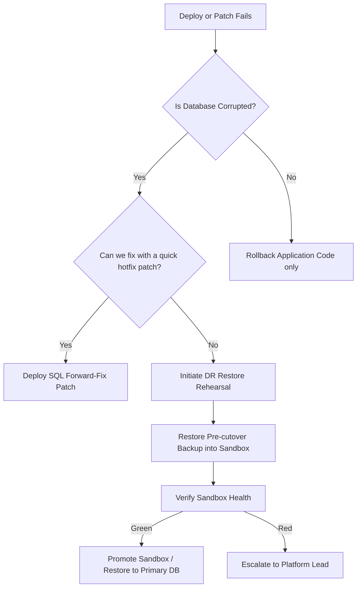

# Disaster Recovery & Backup Rehearsal Runbook

This runbook documents the safe, rehearsable, and evidence-backed backup and restore procedures for the RestaurantPOS backend. It outlines the disaster recovery (DR) tiers, safety guards, and operator drill steps required to establish continuous database recoverability without endangering live production data.

## 1. Scope
This runbook covers:
- Database backup procedures using `scripts/ops/backup-to-s3.sh` and `tools/mysql/backup_release.php`.
- Database restore procedures using `scripts/ops/restore-from-s3.sh` and `tools/mysql/restore_release.php`.
- Staging and dry-run DR drill execution using `scripts/ops/run-dr-rehearsal.sh` and `booking:dr-drill`.
- Automated validation of restored schemas, domain invariants, and golden flows against isolated scratch-database sandboxes.

## 2. What This Runbook Does Not Do
- This runbook **does not** perform automated production deployment.
- This runbook **does not** automatically restore data to the live production database.
- This runbook **does not** manage AWS credentials or provision physical S3 buckets.

> [!CRITICAL]
> **NEVER** run destructive restore operations on the live production database instance. Destructive restores must only be directed at isolated scratch/sandbox database targets.

## 3. Backup Tiers

### Tier 1 — Local / Dry-run Safety
- **Target environment**: Local developer machine or temporary test runners.
- **S3 connection**: Skipped. The scripts run in `--local-only` or `--dry-run` modes, utilizing local directory paths or Mock environments.
- **Verification depth**: Confirms `mysqldump` and `gzip` execute correctly, outputs valid `.sql.gz` dump files, creates matching SHA-256 checksums, and formats the manifest cleanly.

### Tier 2 — Staging Rehearsal
- **Target environment**: Staging sandbox.
- **S3 connection**: S3 Staging bucket (`BACKUP_S3_BUCKET`).
- **Verification depth**: Executes automated DR drills that backup the staging database, restore it into a scratch target database (e.g., `restaurant_pos_restore_drill`), and perform schema probes plus domain invariant verification (`booking:doctor`, `booking:deploy-check`). Creates audit-safe evidence files.

### Tier 3 — Production Pre-cutover
- **Target environment**: Production pre-deployment window.
- **S3 connection**: Production secure S3 bucket.
- **Verification depth**: Performs a full encrypted or locked production database backup before any schema patches or major releases are applied. Restores are dry-run only unless an isolated sandbox recovery drill is performed.

## 4. Required Environment Variables

Configure these variables inside your local environment or secure vault (e.g., CI secrets or `.env` files). **Do not commit plaintext credentials to the repository.**

```bash
# Database Source (for Backups)
DB_HOST=127.0.0.1
DB_PORT=3306
DB_DATABASE=restaurantdb
DB_USERNAME=root
DB_PASSWORD=secret_password

# S3 Configuration
BACKUP_S3_BUCKET=restaurant-pos-dr-backups
BACKUP_S3_PREFIX=db-backups/
AWS_REGION=ap-southeast-1

# Restore Execution Safety (Strictly Required for Restores)
CONFIRM_RESTORE=yes
RESTORE_TARGET_DB=restaurant_pos_restore_drill
ALLOW_DESTRUCTIVE_RESTORE=yes
```

## 5. AWS / S3 / IAM Requirements
The operator execution role or service account must be granted **least-privilege** permissions to interact with the target S3 bucket. Do not use root AWS credentials.

### IAM Least Privilege Policy
```json
{
  "Version": "2012-10-17",
  "Statement": [
    {
      "Sid": "DRBackupBucketAccess",
      "Effect": "Allow",
      "Action": [
        "s3:PutObject",
        "s3:GetObject",
        "s3:ListBucket"
      ],
      "Resource": [
        "arn:aws:s3:::restaurant-pos-dr-backups",
        "arn:aws:s3:::restaurant-pos-dr-backups/db-backups/*"
      ]
    }
  ]
}
```

## 6. Backup Procedure

To trigger a database backup, run the hardened backup script:
```bash
# Run local-only backup (skips S3 upload)
scripts/ops/backup-to-s3.sh --local-only

# Run full staging/production backup with S3 upload
scripts/ops/backup-to-s3.sh
```

### Safety Features
- **Timestamped Artifacts**: Dump files are named as `${DB_DATABASE}_YYYYMMDDtHHMMSSZ.sql.gz`.
- **Non-zero Size Validation**: The script automatically aborts if the dump produces a zero-byte file, preventing silent compression failures.
- **SHA-256 Checksum Generation**: Creates a sidecar `.sha256` checksum inventory file alongside each dump.
- **Safe Metadata JSON**: Writes a secret-free `.metadata.json` recording backup metrics.

## 7. Restore Procedure

To perform a database restore, execute the hardened restore script:
```bash
# Run a dry-run restoration (download and verification only)
scripts/ops/restore-from-s3.sh --dry-run s3://restaurant-pos-dr-backups/db-backups/restaurantdb_20260531T023041Z.sql.gz

# Execute full restore into isolated target
export CONFIRM_RESTORE=yes
export RESTORE_TARGET_DB=restaurant_pos_restore_drill
export ALLOW_DESTRUCTIVE_RESTORE=yes
scripts/ops/restore-from-s3.sh s3://restaurant-pos-dr-backups/db-backups/restaurantdb_20260531T023041Z.sql.gz
```

### Safety Guardrails
- **Production Blocks**: The restore script strictly blocks execution if `APP_ENV=production` or `RESTORE_TARGET=production` is detected, unless multi-step confirmation flags are explicitly supplied (`I_AM_SURE_I_WANT_TO_DESTROY_PRODUCTION=yes`).
- **Target Name Enforcement**: The target database name must contain one of: `restore`, `rehearsal`, `scratch`, `drill`, `sandbox`, or `tmp`.
- **Integrity Validation**: The script verifies the SHA-256 checksum and tests the gzip stream structure (`gunzip -t`) before initiating any import.

## 8. Checksum Verification
The checksum file (`.sha256`) acts as the cryptographical seal for the backup package. Before every restore, the runner verifies the file's hash:
```bash
# Calculated internally by restore-from-s3.sh
sha256sum --check <backup_name>.sha256
```
If a mismatch is detected, the script terminates immediately with a non-zero exit code to prevent corrupt imports.

## 9. Evidence JSON Format
When a DR drill successfully finishes, it generates a secret-free launch readiness evidence JSON file at `storage/app/booking_release/launch_readiness/manual_evidence.json`:

```json
{
  "checks": {
    "disaster_recovery_restore_evidence": {
      "status": "pass",
      "performed_by": "ops.release",
      "performed_at_utc": "2026-05-31T02:30:41Z",
      "notes": "Safe DR restore rehearsal automated evidence.",
      "restored_dump_identifier": "full C:\\Users\\Duong Vinh\\RestaurantPOS-Laravel\\storage\\app\\booking_backups\\20260531T023041Z-restaurantdb/full.sql.gz",
      "restore_target": "restaurant_pos_restore_drill",
      "verification_command": "php artisan booking:dr-drill --mode=full-isolated-restore --manifest=C:\\Users\\Duong Vinh\\RestaurantPOS-Laravel\\storage\\app\\booking_backups\\20260531T023041Z-restaurantdb\\manifest.json --json --target-db=restaurant_pos_restore_drill",
      "verification_result": "pass",
      "operator": "ops.release",
      "reviewer": "release.lead"
    }
  }
}
```

## 10. Staging DR Drill Steps
1. Verify the staging environment configurations are active.
2. Prime the Redis scheduler heartbeat:
   ```bash
   php artisan booking:ops-heartbeat:touch scheduler
   ```
3. Run the automated DR drill rehearsal command:
   ```bash
   scripts/ops/run-dr-rehearsal.sh --local-only
   ```
4. Verify all tests and contract validations report green (0 failures).
5. Compile and place `manual_evidence.json` inside the launch-readiness directory.
6. Verify the launch readiness matrix evaluates successfully:
   ```bash
   php artisan booking:launch-readiness --target=staging --manual-evidence=storage/app/booking_release/launch_readiness/manual_evidence.json --json
   ```

## 11. Production Pre-cutover Backup Steps
1. Announce the maintenance/cutover window.
2. Put the POS services into read-only or maintenance mode.
3. Capture a fresh database dump:
   ```bash
   scripts/ops/backup-to-s3.sh
   ```
4. Confirm S3 upload integrity report displays success.
5. Record the backup identifier and metadata JSON for rollback capability.

## 12. Rollback vs Forward-Fix Decision Tree



- **Rollback Window**: Restoring from backup should only be attempted if data corruption has occurred. For code-only failures, rollback the Git release/deployment artifact.
- **Forward-Fix Rule**: Prefer deploying a backward-compatible forward SQL patch to fix schema issues, as full database restores will overwrite all writes captured since the backup timestamp.

## 13. Common Failures and Fixes
- **Error: `Unknown column 'zone_id' in 'field list'`**
  - *Cause*: The disaster recovery database probe configuration in `config/booking_disaster_recovery.php` referenced outdated schema columns.
  - *Fix*: Align the `sample_tables` column array with the active schema dump in `mysql-schema.sql` (e.g., using `zone` instead of `zone_id` and `waiting_id` instead of `waiting_list_id`).
- **Error: `staff_api_keys_missing_active_keys`**
  - *Cause*: The source database was entirely empty of active staff API keys, causing the restored database to fail deploy check pre-flight/post-flight constraints.
  - *Fix*: Boot and provision a default site by running `php artisan booking:bootstrap-site --show-secret-once` before executing the backup.

## 14. Verification Commands
- Check launch readiness status:
  ```bash
  php artisan booking:launch-readiness --target=staging --manual-evidence=storage/app/booking_release/launch_readiness/manual_evidence.json --json
  ```
- Run Artisan DR drill directly:
  ```bash
  php artisan booking:dr-drill --mode=full-isolated-restore --target-db=restaurant_pos_restore_drill --drop-target-first --json
  ```
- Run verification tests:
  ```bash
  php artisan test tests/Feature/Console/BookingDisasterRecoveryDrillCommandTest.php
  ```

## 15. Remaining Blockers
- **Live AWS/S3 Target**: Running database back-ups in staging or production still requires provisioning real, secure S3 staging/production buckets and supplying matching IAM environment credentials.

## 16. No Production-Ready Claim
This runbook establishes a *rehearsable local dry-run / staging rehearsal framework*. It **does not** imply production readiness or execute automated production migrations. Actual production cutover remains blocked until real S3 bucket integration is confirmed.
